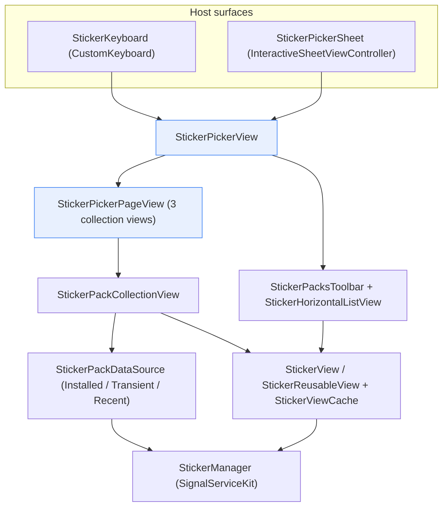
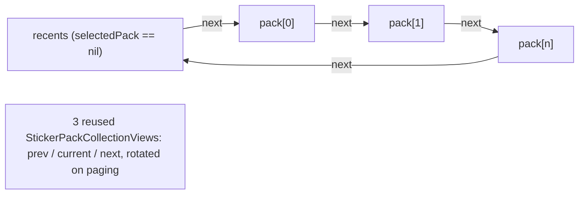
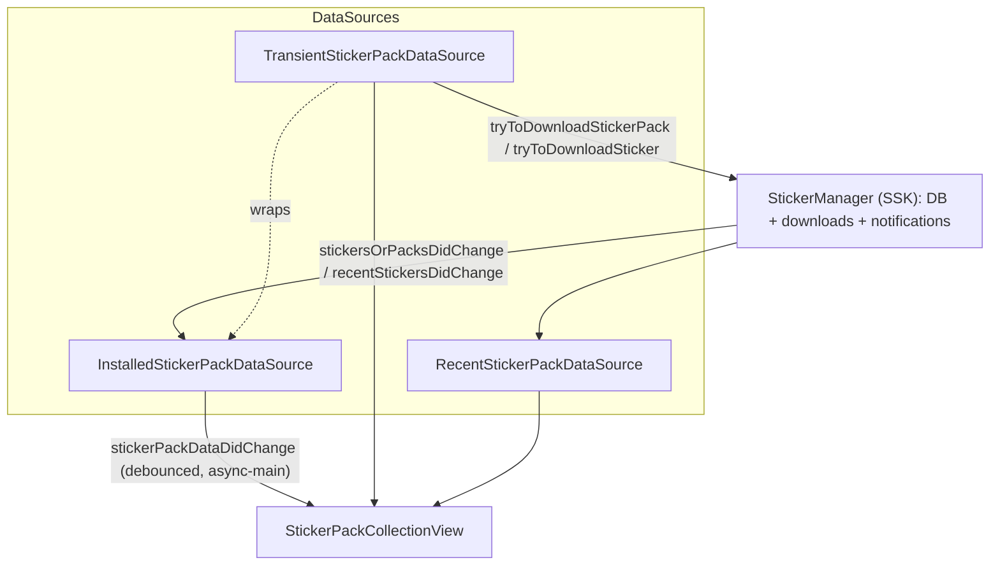

# Stickers

Source: `SignalUI/Stickers/`. The reusable UI and client-side data-sourcing layer
for Signal's **sticker packs** — the sticker picker (keyboard / sheet), the
horizontal pack-selector toolbar, the paged per-pack grid, individual sticker
rendering + caching, the sticker-pack data sources that broker between the UI and
`StickerManager` in SignalServiceKit, and the "editor stickers" (clock stickers for
stories). The app's conversation input toolbar and the story/media editors build
their sticker surfaces on these types.

> Confidence: **[High]** read in full; **[Medium]** signature/partial; **[Low]**
> inferred. Citations are `File.swift:line`. An uncited claim is a defect.

## Where this sits

**[High]** Everything here depends on SignalServiceKit (`import SignalServiceKit`
at the top of each file, e.g. `SignalUI/Stickers/StickerPicker.swift:6`). The
subsystem is UI + light client-side state; the authoritative sticker/pack store,
download, and persistence live in SSK's `StickerManager` (referenced throughout but
defined outside `SignalUI/`). The UI reads/observes `StickerManager` and renders;
it does not own the database.

## Entry points: delegates and host surfaces

**[High]** The public contract for "the user picked a sticker" is the small
`StickerPickerDelegate` protocol with `didSelectSticker(_ stickerInfo:)`
(`SignalUI/Stickers/StickerPicker.swift:17-19`). The same file defines the story
sticker contract `StoryStickerPickerDelegate.didSelect(storySticker:)`
(`SignalUI/Stickers/StickerPicker.swift:8-10`) and the
`StoryStickerConfiguration` enum (`.hide` / `.showWithDelegate(...)`) that controls
whether the editor/story clock stickers appear in the picker
(`SignalUI/Stickers/StickerPicker.swift:12-15`).

**[High]** Two host surfaces wrap the shared `StickerPickerView`:

- `StickerKeyboard` is a `CustomKeyboard` used as an in-app keyboard (e.g. the
  conversation input toolbar). It owns a `StickerPickerView`, forwards presentation
  lifecycle (`willBePresented()` / `wasPresented()`), and bridges its
  `StickerKeyboardDelegate` — `stickerKeyboardDidRequestPresentManageStickersView`
  and `stickerKeyboard(_:didSelect:)`
  (`SignalUI/Stickers/StickerPickerKeyboard.swift:10-16`,
  `:17`, `:66-74`).
- `StickerPickerSheet` is an `InteractiveSheetViewController` (used from media/story
  editors) that renders over a dark blur. Its selection delegate is
  `StickerPickerDelegate & StoryStickerPickerDelegate` and it configures the picker
  with `.showWithDelegate(...)` so story clock stickers show
  (`SignalUI/Stickers/StickerPickerSheet.swift:34-45`). Its optional
  `StickerPickerSheetDelegate.makeManageStickersViewController(for:)` supplies the
  "manage stickers" screen; if that delegate is nil the manage button is hidden
  (`SignalUI/Stickers/StickerPickerSheet.swift:8-9`, `:23-30`, `:93-96`).

**[Medium]** The "manage stickers" screen itself is not in this directory — these
surfaces only *request* its presentation via their host delegate and (for the
sheet) a factory callback. The concrete manager lives in the app target.

## `StickerPickerView` and its paging engine

**[High]** `StickerPickerView` (internal to the module) is the composed picker:
a `StickerPickerPageView` filling the view plus a `StickerPacksToolbar` pinned to
the bottom (`SignalUI/Stickers/StickerPickerView.swift:13`, `:31`, `:40`,
`:75-77`). It conforms to `StickerPickerViewDelegate` (which refines
`StickerPickerDelegate` with `presentManageStickersView(for:)`,
`SignalUI/Stickers/StickerPickerView.swift:8-11`) and routes toolbar/page callbacks
to its own `delegate`. It also computes content insets so the paged grid clears the
floating toolbar (`SignalUI/Stickers/StickerPickerView.swift:96-120`).

**[High]** `StickerPickerPageView` (private) is the horizontally-paged carousel of
packs (`SignalUI/Stickers/StickerPickerView.swift:368`). It keeps a **fixed
three-element array** of `StickerPackCollectionView`s representing previous /
current / next page (indices 0/1/2,
`SignalUI/Stickers/StickerPickerView.swift:542-546`) inside a single paging
`UIScrollView` (`SignalUI/Stickers/StickerPickerView.swift:561`, `:605`). As the
user pages, the array is rotated (`removeLast()`/`insert(at:0)` or
`removeFirst()`/`append`) and only the newly-exposed page is reloaded, rather than
re-laying three fresh collection views
(`SignalUI/Stickers/StickerPickerView.swift:689-721`). `nil` as the "selected pack"
is the special-case **recents** page
(`SignalUI/Stickers/StickerPickerView.swift:376`, `:528`, `:572-583`).

**[High]** The installed packs are loaded on the main thread inside a DB read,
sorted newest-first by `dateCreated`
(`SignalUI/Stickers/StickerPickerView.swift:461-467`), and the view observes
`StickerManager.stickersOrPacksDidChange` to reload
(`SignalUI/Stickers/StickerPickerView.swift:399-400`, `:518-520`). For RTL layouts
the pack order is simply reversed
(`SignalUI/Stickers/StickerPickerView.swift:501-503`). Scroll-state bookkeeping
(`isUserScrolling` / `isWaitingForDeceleration` / `isScrollingChange`) exists so
page-change side effects fire only for user-initiated scrolls and are applied as the
threshold is crossed to avoid UI jitter
(`SignalUI/Stickers/StickerPickerView.swift:772-780`, `:798-818`).

## The pack toolbar + horizontal list

**[High]** `StickerPacksToolbar` (private, in `StickerPickerView.swift:143`) is the
bottom bar holding a scrollable `StickerHorizontalListView` of pack covers plus a
"manage" (`+`) button; the manage button is hidden when there is no toolbar delegate
(`SignalUI/Stickers/StickerPickerView.swift:316-336`, `:354-355`). Its chrome
branches on OS version: a glass capsule (`UIGlassEffect`) on iOS 26+, a blur
(`UIBlurEffect`) on earlier versions, and a plain background when "Reduce
Transparency" is enabled (`SignalUI/Stickers/StickerPickerView.swift:162-176`).
Heights/insets are hand-computed and cached
(`SignalUI/Stickers/StickerPickerView.swift:210-241`).

**[High]** `StickerHorizontalListView` is a `UICollectionView` with a custom
single-row `LinearHorizontalLayout`
(`SignalUI/Stickers/StickerHorizontalListView.swift:109`, `:232`). Its rows are
driven by the `StickerHorizontalListViewItem` protocol (`view`, `didSelectBlock`,
`isSelected`, `accessibilityName`,
`SignalUI/Stickers/StickerHorizontalListView.swift:8-13`) with two conformers:
`StickerHorizontalListViewItemSticker` (a pack cover, rendered through the shared
`StickerViewCache`, `SignalUI/Stickers/StickerHorizontalListView.swift:17`) and
`StickerHorizontalListViewItemRecents` (the recents clock icon,
`SignalUI/Stickers/StickerHorizontalListView.swift:79`). Selection state is drawn
via a per-cell `configurationUpdateHandler` background pill
(`SignalUI/Stickers/StickerHorizontalListView.swift:154`). The layout mirrors itself
for RTL via `flipsHorizontallyInOppositeLayoutDirection`
(`SignalUI/Stickers/StickerHorizontalListView.swift:255-257`).

## The per-pack grid: `StickerPackCollectionView`

**[High]** `StickerPackCollectionView` is the public grid showing the stickers of
one pack (or recents). It is both delegate and data source of itself
(`SignalUI/Stickers/StickerPackCollectionView.swift:13`). It is bound to a
`StickerPackDataSource` via mode helpers — `showInstalledPack`,
`showUninstalledPack`, `showRecents`, `showInstalledPackOrRecents`, and `show(dataSource:)`
(`SignalUI/Stickers/StickerPackCollectionView.swift:105-129`) — and registers itself
as a `StickerPackDataSourceDelegate` to reload on data changes
(`SignalUI/Stickers/StickerPackCollectionView.swift:17-19`, `:555`).

**[High]** Notable behaviors:

- **Transient (not-yet-installed) packs** show *all* stickers from the pack
  manifest (so download-in-progress stickers appear as placeholders), whereas
  installed/recents sources show only the installed infos
  (`SignalUI/Stickers/StickerPackCollectionView.swift:227-240`).
- **Story stickers** (clock editor stickers) are injected as a separate section 0,
  but only on the recents page and only when the configuration is
  `.showWithDelegate` (`SignalUI/Stickers/StickerPackCollectionView.swift:36-43`,
  `numberOfSections`/section headers at `:402-403`, `:459-460`). Selecting one
  routes to `StoryStickerPickerDelegate.didSelect(storySticker:)`
  (`SignalUI/Stickers/StickerPackCollectionView.swift:375-385`).
- **Long-press preview**: a long press shows an enlarged sticker over a host view
  supplied by the delegate (`stickerPreviewHostView()` / `stickerPreviewHasOverlay()`,
  `SignalUI/Stickers/StickerPackCollectionView.swift:9-11`, `:250`, `:285-301`).
- **Empty state**: when there are no stickers, an on-demand "content unavailable"
  view with localized `STICKER_CATEGORY_RECENTS_EMPTY_*` strings is shown
  (`SignalUI/Stickers/StickerPackCollectionView.swift:156-205`).
- **Adaptive grid**: cell size is recomputed from available width toward a
  preferred ~80 dp cell across a column count derived at layout time
  (`SignalUI/Stickers/StickerPackCollectionView.swift:533-542`).

## Data sources: `StickerPackDataSource`

**[High]** `StickerPackDataSource` is the protocol the grid consumes: it exposes
`info`/`title`/`author`, `getStickerPack()`, `installedCoverInfo`,
`installedStickerInfos`, `metadata(forSticker:)`, and an observer registration
`add(delegate:)` (`SignalUI/Stickers/StickerPackDataSource.swift:17-32`). Change
notification goes through `StickerPackDataSourceDelegate.stickerPackDataDidChange()`
(`SignalUI/Stickers/StickerPackDataSource.swift:10-12`).

**[High]** `BaseStickerPackDataSource` provides the shared machinery: weakly-held
delegates, and a `DebouncedEvent` (`.firstLast`, 0.5 s) that coalesces change
notifications and dispatches them **async on main** specifically to avoid firing a
delegate callback from inside an open DB transaction
(`SignalUI/Stickers/StickerPackDataSource.swift:36`, `:49-72`). Its `coverInfo` and
`stickerInfos` properties fire change events only when the content actually changes
(`SignalUI/Stickers/StickerPackDataSource.swift:84-110`).

**[High]** Three concrete sources (all observe relevant SSK notifications and
re-derive their state):

- `InstalledStickerPackDataSource` reads installed state for one pack from the DB
  (`fetchInstalledState`, ignoring packs that are "saved" but not "installed"),
  observes `StickerManager.stickersOrPacksDidChange` and
  `.OWSApplicationDidBecomeActive`, and kicks off `StickerManager.ensureDownloadsAsync`
  for missing stickers (`SignalUI/Stickers/StickerPackDataSource.swift:115`, `:146`,
  `:197-229`, `:239`). `metadata(forSticker:)` uses
  `StickerManager.installedStickerMetadataWithSneakyTransaction` and intentionally
  skips the on-disk existence check because it runs on the main thread per sticker
  (`SignalUI/Stickers/StickerPackDataSource.swift:294-297`).
- `TransientStickerPackDataSource` backs **not-yet-installed** packs: it wraps an
  internal `InstalledStickerPackDataSource` (preferring installed data when present),
  downloads the manifest via `StickerManager.tryToDownloadStickerPack`, and
  (optionally, per `shouldDownloadAllStickers`) each sticker via
  `tryToDownloadSticker`, caching per-sticker `DecryptedStickerMetadata` keyed to
  temporary files (`SignalUI/Stickers/StickerPackDataSource.swift:307`, `:314`,
  `:421`, `:473`, `:505`). It tracks in-flight downloads with a `downloadKeySet` and
  **eagerly deletes its temporary files in `deinit`**
  (`SignalUI/Stickers/StickerPackDataSource.swift:334`, `:359-368`, `:409`).
- `RecentStickerPackDataSource` simply mirrors `StickerManager.recentStickers()`,
  observing `StickerManager.recentStickersDidChange`; its pack-identity accessors
  `owsFailDebug` because recents has no pack
  (`SignalUI/Stickers/StickerPackDataSource.swift:613`, `:621`, `:629`, `:646-666`).

## Sticker rendering + caching

**[High]** `StickerView` is a stateless factory (private `init`) producing a
`UIView` for a sticker from its `StickerMetadata`. It validates the image, reads the
sticker data, and renders animated formats (`.webp`/`.apng`/`.gif`) via SDWebImage's
`SDAnimatedImageView` (`SignalUI/Stickers/StickerView.swift:10`, `:60-88`,
specifically the format switch at `:77-85`). It can source metadata from a passed
data source or from `StickerManager.installedStickerMetadataWithSneakyTransaction`
(`SignalUI/Stickers/StickerView.swift:15-37`). (Lottie is imported but animated
display here goes through SDWebImage. **[Medium]** — only the switch over
`StickerType` was observed.)

**[High]** `StickerReusableView` wraps a sticker view and cross-fades between a
`StickerPlaceholderView` and the real sticker as data loads
(`SignalUI/Stickers/StickerView.swift:91`, `:115`, `:119`, `:140`).
`StickerViewCache` is an
`LRUCache<StickerInfo, ThreadSafeCacheHandle<StickerReusableView>>` with
`nseMaxSize: 0` (never caches in the NSE) and background eviction, exposed with an
NSCache-compatible API (`SignalUI/Stickers/StickerViewCache.swift:7-18`, `:40-54`).
Both the grid and the toolbar hold a `StickerViewCache(maxSize: 32)` to reuse
rendered sticker views (`SignalUI/Stickers/StickerPackCollectionView.swift:341`,
`SignalUI/Stickers/StickerPickerView.swift:444`).

## Editor stickers (`EditorSticker`)

**[High]** `EditorSticker` is an enum of either a `.regular(StickerInfo)` or a
`.story(StorySticker)` (`SignalUI/Stickers/EditorSticker.swift:29-31`). The
`StorySticker` cases are **clock stickers** for stories — `clockDigital(DigitalClockStyle)`
and `clockAnalog(AnalogClockStyle)` — each able to produce a live `previewView()`
and cycle styles via `nextStyle()`/`stickerWithNextStyle()`
(`SignalUI/Stickers/EditorSticker.swift:35-40`, digital styles at `:68`, `:137-152`,
analog styles at `:161`, `:272-285`). `StorySticker.pickerStickers` is the default
set shown in the picker's "featured" section
(`SignalUI/Stickers/EditorSticker.swift:56`). The analog clock is drawn with a
custom `AnalogClockLayer` (`CALayer` subclass) that positions hour/minute hands from
the current time using per-style PDF asset images and geometry constants
(`SignalUI/Stickers/EditorSticker.swift:167-170`, `:293`, `:314`).

## Notable considerations

- **[High]** **Main-thread discipline + transaction safety.** Data sources assert
  `AssertIsOnMainThread()` and deliberately dispatch change callbacks async on the
  main queue so they never run inside an open DB transaction
  (`SignalUI/Stickers/StickerPackDataSource.swift:49-72`).
- **[High]** **Persistence is in SSK, not here.** Installed/saved packs, recents,
  manifests, and sticker data are owned by `StickerManager`; this subsystem only
  reads, observes change notifications, and triggers downloads. The transient source
  is the only one that manages its own (temporary, `deinit`-cleaned) files
  (`SignalUI/Stickers/StickerPackDataSource.swift:359-368`).
- **[High]** **View reuse over re-render.** The three-collection-view carousel and
  the per-surface `StickerViewCache(maxSize: 32)` exist to keep paging/scrolling
  cheap for animated stickers (`SignalUI/Stickers/StickerPickerView.swift:542-546`,
  `:444`).
- **[High]** **OS-version-adaptive chrome.** The toolbar and keyboard backdrop
  branch between iOS 26 glass, pre-26 blur, and reduce-transparency fallbacks
  (`SignalUI/Stickers/StickerPickerView.swift:162-176`;
  `SignalUI/Stickers/StickerPickerKeyboard.swift:28-37`).
- **[Medium]** **Localized strings & assets.** Category/empty-state copy uses
  `OWSLocalizedString` keys (`STICKER_CATEGORY_*`), and analog-clock art references
  PDF image literals (`clock-*.pdf`) resolved from the asset catalog
  (`SignalUI/Stickers/StickerPackCollectionView.swift:160-166`, `:459-460`;
  `SignalUI/Stickers/EditorSticker.swift:170`).
