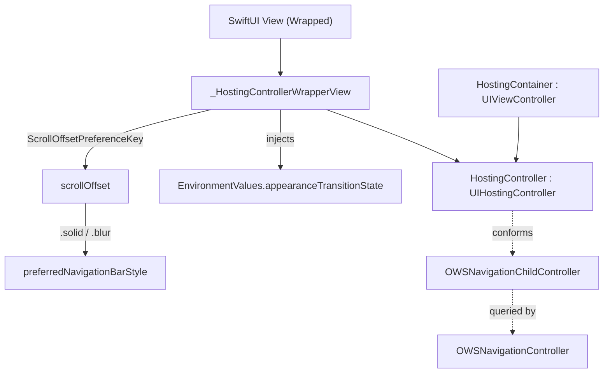

# SwiftUI Extensions

Source: `SignalUI/SwiftUIExtensions/`. A small set of SwiftUI helpers — the
UIKit↔SwiftUI hosting bridge plus a handful of reusable views, view modifiers,
and property wrappers that give SignalUI's SwiftUI surfaces a consistent
navigation, scrolling, animation, link, async-task, and accessibility vocabulary.

This README is a focused deep-dive into the eight files in that directory; the
higher-level cross-cutting overview (which also covers `UIKitExtensions/`) lives
in [Extensions.md](../Extensions.md).

> Confidence: **[High]** read in full; **[Medium]** signature/partial; **[Low]**
> inferred. Citations are `File.swift:line`. An uncited claim is a defect.

## Responsibility

**[High]** This directory is purely leaf-level SwiftUI support code: every file
declares `public import SwiftUI` and exposes `public` API intended for use by
other SignalUI surfaces and by the app. There is no business logic, model, or
networking here — only presentation helpers. The one piece that reaches into the
rest of the module is the hosting bridge, which bridges SwiftUI content into
Signal's UIKit navigation stack.

## Hosting bridge (`HostingController.swift`)

The hosting bridge is the most consequential type in the directory because it is
the seam between SwiftUI content and Signal's UIKit navigation chrome.

**[High]** `HostingController<Wrapped: View>` is an `open class` subclassing
`UIHostingController` and conforming to `OWSNavigationChildController`
(`SignalUI/SwiftUIExtensions/HostingController.swift:86`; the protocol is defined
at `SignalUI/ViewControllers/OWSNavigationController.swift:10`). It wraps its
`rootView` in the private `_HostingControllerWrapperView` so it can inject
additional environment values and observe scroll offset
(`SignalUI/SwiftUIExtensions/HostingController.swift:96-98`,
`:155-167`).

**[High]** It injects `EnvironmentValues.appearanceTransitionState` into the
wrapped view (`SignalUI/SwiftUIExtensions/HostingController.swift:29-33`,
`:161`), a value of type `HostingControllerAppearanceTransitionState`
(`.appearing` / `.finished` / `.cancelled`,
`SignalUI/SwiftUIExtensions/HostingController.swift:10-14`). The controller drives
this through the appearance lifecycle: it sets `.appearing` in `viewWillAppear`,
then uses the `transitionCoordinator` to set `.finished` or `.cancelled` when the
navigation transition completes, and resets to `nil` on `viewWillDisappear`
(`SignalUI/SwiftUIExtensions/HostingController.swift:105-132`). The purpose
(per the doc comment at `:79-84`) is to let SwiftUI views explicitly control
whether animations run during a navigation transition or only after it finishes.

**[High]** It also tracks a `scrollOffset` property whose `didSet` detects a sign
flip and asks the navigation controller to refresh its navbar appearance
(`SignalUI/SwiftUIExtensions/HostingController.swift:87-95`). The offset is fed in
from the wrapped view via a `ScrollOffsetPreferenceKey` preference-change callback
(`SignalUI/SwiftUIExtensions/HostingController.swift:162`; the key is defined
in the Appearance subsystem at
`SignalUI/Appearance/SwiftUI/ScrollOffset.swift:54`). Offset state is then surfaced
through the `OWSNavigationChildController` overrides: `preferredNavigationBarStyle`
returns `.solid` when scrolled to the top and `.blur` otherwise, and
`navbarBackgroundColorOverride` returns the grouped-background color only in the
solid state (`SignalUI/SwiftUIExtensions/HostingController.swift:136-146`). These
overrides are consumed by `OWSNavigationController` — see
[ViewControllers.md](../ViewControllers.md).

**[High]** `HostingContainer<Wrapped: View>` is an `open class` `UIViewController`
that embeds a `HostingController` as a child and pins it to its edges
(`SignalUI/SwiftUIExtensions/HostingController.swift:35`, `viewDidLoad` at `:48-53`).
It forwards every `OWSNavigationChildController` override to the inner controller
(`:57-75`). Its doc comment explains the intent: it exists so UIKit callers can set
navigation bar-button items manually, working around `UIHostingController`'s
behavior of only displaying bar buttons once the view has fully appeared
(`SignalUI/SwiftUIExtensions/HostingController.swift:31-34`).

**[Medium]** `_HostingControllerWrapperView` is the private wrapper view that
applies the `appearanceTransitionState` environment value and wires the
`ScrollOffsetPreferenceKey` change into the controller's callback
(`SignalUI/SwiftUIExtensions/HostingController.swift:155-167`). The leading
underscore and `fileprivate` stored properties signal it is an implementation
detail, even though the type is `public` (required because it is the generic
parameter of the `UIHostingController` superclass).

## Scrolling helpers

**[High]** `ScrollBounceBehaviorIfAvailableModifier` is a `ViewModifier` that
back-ports SwiftUI's `scrollBounceBehavior` to the module's deployment target: its
nested `Behavior` enum (`.automatic` / `.always` / `.basedOnSize`) maps to the real
`ScrollBounceBehavior` only when running on iOS 16.4+, and otherwise passes content
through unchanged (`SignalUI/SwiftUIExtensions/ScrollBounceBehaviorIfAvailable.swift:8-39`).
It is applied via the `View.scrollBounceBehaviorIfAvailable(_:)` convenience
(`SignalUI/SwiftUIExtensions/ScrollBounceBehaviorIfAvailable.swift:42-44`), and the
other scrolling helpers in this directory use it rather than calling the system API
directly.

**[High]** `ScrollableWhenCompact<Content: View>` reads the
`verticalSizeClass` environment value and wraps its content in a `ScrollView` only
when the size class is `.compact` (e.g. landscape phones), applying
`.scrollBounceBehaviorIfAvailable(.basedOnSize)`; otherwise it renders the content
directly (`SignalUI/SwiftUIExtensions/ScrollableWhenCompact.swift:8-26`). This lets
a layout that normally fits the screen become scrollable only when vertical space
is tight.

**[High]** `ScrollableContentPinnedFooterView<ScrollableContent, PinnedFooter>` is a
two-slot container: scrollable content plus a footer pinned to the bottom
(`SignalUI/SwiftUIExtensions/ScrollableContentPinnedFooterView.swift:8`). Its
`centersContentVertically` option (documented at `:19-21`) centers content shorter
than the viewport while still letting taller content scroll. It branches on OS
version (`SignalUI/SwiftUIExtensions/ScrollableContentPinnedFooterView.swift:30-36`):
on iOS 26+ it uses `safeAreaBar(edge: .bottom)` with the system
`scrollBounceBehavior` and a `containerRelativeFrame(.vertical)` spacer for
centering (`:39-66`); on iOS 18 it falls back to a `GeometryReader`-measured
`ScrollView` with the footer as a sibling in a `VStack`, using a `Color.clear`
spacer sized to the measured viewport for centering (`:68-91`). This is a notable
UI consideration: the same public API produces visually equivalent layout across
two meaningfully different SwiftUI scroll/safe-area implementations.

## Links & animation

**[High]** `Text.appendLink(_:useBold:tint:action:)` appends a tappable, tinted
(default `Color.Signal.link`) link to the end of a `Text`, including a leading
space (`SignalUI/SwiftUIExtensions/Text+Links.swift:11-27`). It uses a placeholder
`https://support.signal.org/` URL inside Markdown link syntax purely so SwiftUI
renders a link, then overrides `EnvironmentValues.openURL` with an `OpenURLAction`
that discards the URL and invokes the supplied `action` closure, returning
`.handled` (`SignalUI/SwiftUIExtensions/Text+Links.swift:20-25`). The preview
pairs it with `CommonStrings.learnMore` (`:30-35`). **[Medium]** This is the
canonical pattern for "Learn more"-style inline actions in SignalUI SwiftUI views;
`SignalServiceKit` is imported for `CommonStrings`
(`SignalUI/SwiftUIExtensions/Text+Links.swift:5`).

**[High]** `Animation.quickSpring()` is a static factory returning a spring
animation with `response: 0.3, dampingFraction: 1`
(`SignalUI/SwiftUIExtensions/SwiftUI+Animations.swift:7-11`) — a shared, named
animation so Signal's SwiftUI surfaces animate consistently.

## Async task modifier (`AsyncViewTask.swift`)

**[High]** `AsyncViewTask` is a `public protocol` refining `Identifiable` that
models an async operation bound to a view's lifetime: it requires `perform() async`
and an optional `priority` (defaulting to `nil`, i.e. `.userInitiated` at the call
site) (`SignalUI/SwiftUIExtensions/AsyncViewTask.swift:10-25`). The
`View.task(_:)` overload takes a `Binding<AsyncTask?>` and applies
`AsyncViewTaskModifier` (`SignalUI/SwiftUIExtensions/AsyncViewTask.swift:63-65`).

**[High]** `AsyncViewTaskModifier` disables the content while a task is running and
drives the task via the `task(id:priority:)` modifier keyed on the task's `id`;
when the task finishes it clears the binding (`defer { task = nil }`), and setting
the binding to `nil` or a new value cancels the previous task
(`SignalUI/SwiftUIExtensions/AsyncViewTask.swift:67-79`). The doc comment at
`:28-61` documents this contract and gives a usage example. **[Medium]** Notable UI
consideration: controls auto-disable for the duration of the task, which prevents
double-submission without the caller writing any `disabled` logic.

## Accessibility layout metric (`AccessibleLayoutMetric.swift`)

**[High]** `AccessibleLayoutMetric<Value: BinaryFloatingPoint>` is a
`@propertyWrapper` conforming to `DynamicProperty` that reads
`EnvironmentValues.dynamicTypeSize` and scales its wrapped value *down* at
accessibility type sizes (default scale `0.67`, customizable via `init(scale:)`)
(`SignalUI/SwiftUIExtensions/AccessibleLayoutMetric.swift:36-62`). Its `update()`
multiplies `rawValue` by the scale only when `dynamicTypeSize.isAccessibilitySize`
is true (`:58-61`), and `projectedValue` returns `self` so callers can reach the
unscaled `rawValue` via `$metric`. The doc comment (`:1-33`) contrasts it with
SwiftUI's `ScaledMetric`, which scales *up*: this wrapper instead tightens spacing
to make room for large text. This is the directory's most explicit
accessibility-oriented helper.

## Interactions with the rest of SignalUI and the app

- **[High]** Navigation chrome: `HostingController` / `HostingContainer` feed the
  `OWSNavigationChildController` protocol
  (`SignalUI/ViewControllers/OWSNavigationController.swift:10`) consumed by
  `OWSNavigationController`; see [ViewControllers.md](../ViewControllers.md).
- **[High]** Appearance subsystem: the scroll-offset → navbar-style behavior
  depends on `ScrollOffsetPreferenceKey`
  (`SignalUI/Appearance/SwiftUI/ScrollOffset.swift:54`) and `Color.Signal`/
  `UIColor.Signal` palette values; see [Appearance.md](../Appearance.md).
- **[High]** Strings: `Text+Links` consumes `CommonStrings` from `SignalServiceKit`
  (`SignalUI/SwiftUIExtensions/Text+Links.swift:5`).
- **[Medium]** All of these types are `public`/`open`, so they are part of
  SignalUI's exported surface and are intended for use by the `Signal` app target
  as well as internally.

## Notable UI considerations (summary)

- **[High]** OS-version branching is explicit and deliberate: iOS 26 vs iOS 18 in
  `ScrollableContentPinnedFooterView`, and the iOS 16.4 availability gate in
  `ScrollBounceBehaviorIfAvailable`.
- **[High]** Animation deferral during navigation transitions is coordinated by the
  `appearanceTransitionState` environment value, not by ad-hoc flags in each view.
- **[High]** Accessibility sizing is handled by scaling layout metrics *down* so
  large dynamic type has room, the inverse of the usual `ScaledMetric` approach.
- **[Medium]** Most files ship a `#Preview` (and `ScrollableContentPinnedFooterView`
  guards its preview with `#if DEBUG`), indicating these helpers are developed and
  demoed in isolation.
