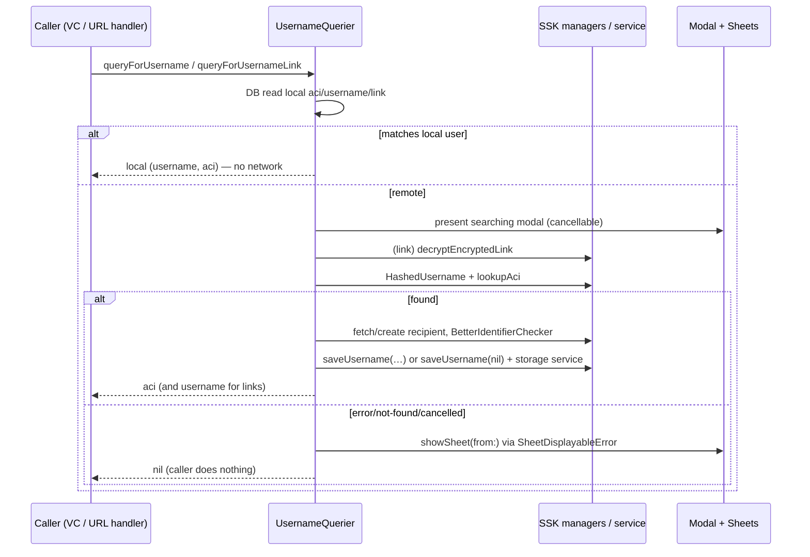
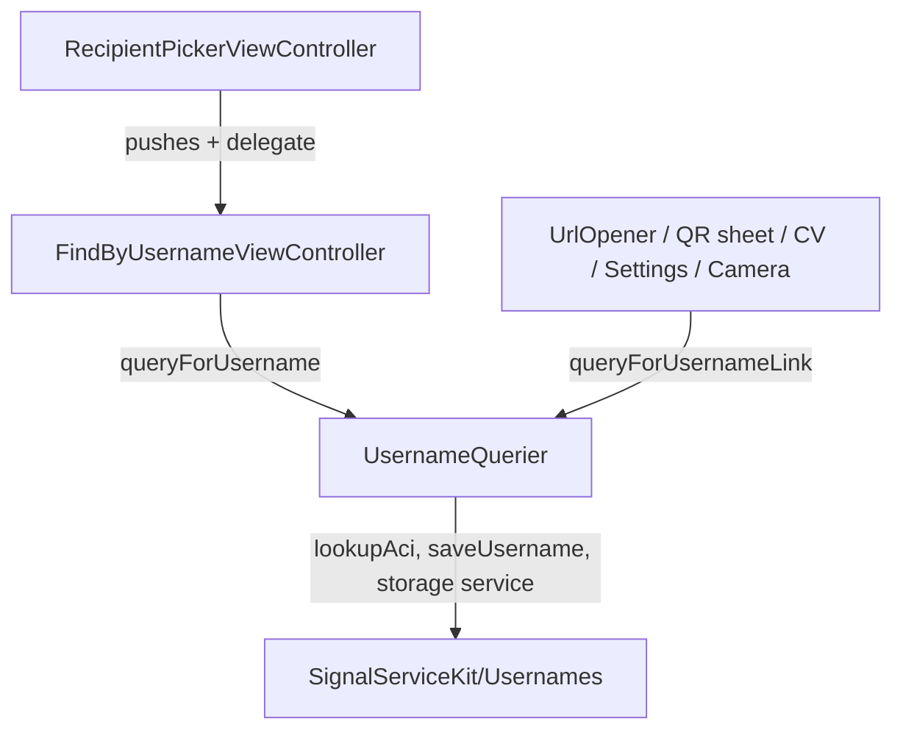

# Usernames (SignalUI)

Source: `SignalUI/Usernames/`. The shared, UI-facing glue for resolving a
*username* or a *username link* into an account (an `Aci`), plus the small screen
that lets a user type a username to start a chat. This is distinct from
`SignalServiceKit/Usernames/` (the data/model/manager layer this subsystem calls
into) and `Signal/Usernames/` (the main-app username *management* surfaces — your
own username, QR links, education sheets). Here the concern is narrow: **look up
someone else's account by username/link, with modal progress and error sheets
handled for the caller.**

> Confidence: **[High]** read in full; **[Medium]** signature/partial or depends on
> collaborators defined outside `SignalUI/`; **[Low]** inferred. Citations are
> `File.swift:line`. An uncited claim is a defect. See the
> [SignalUI README](../README.md) for the shared confidence/citation conventions.

The directory contains two files:

- `UsernameQuerier.swift` — the lookup engine.
- `FindByUsernameViewController.swift` — the "type a username" entry screen.

## `UsernameQuerier` — the lookup engine

**[High]** `UsernameQuerier` is a `public struct` with two initializers: a
zero-argument convenience init that wires itself up from `SSKEnvironment.shared` and
`DependenciesBridge.shared`, and a fully-injected init used for testing
(`SignalUI/Usernames/UsernameQuerier.swift:9`, inits at `:22` and `:40`). Because
construction is cheap and self-wiring, callers across the app just write
`UsernameQuerier()` at the call site rather than holding an instance.

**[High]** Its dependencies span SSK managers: `LocalUsernameManager`,
`UsernameApiClient`, `UsernameLinkManager`, `UsernameLookupManager`,
`RecipientFetcher`/`SignalRecipientManager`, `ProfileManager`, `ContactManager`,
`StorageServiceManager`, `TSAccountManager`, `NetworkManager`, and `DB`
(`SignalUI/Usernames/UsernameQuerier.swift:10-20`). SignalUI's role is purely to
orchestrate these SSK pieces and own the *UI* consequences (modals/sheets).

It exposes two `@MainActor` public entry points. Both follow the same contract,
spelled out in their doc comments: they **internally handle error presentation**,
and a `nil` return means "the caller should do nothing" (the user already saw a
sheet or cancelled).

### `queryForUsernameLink(link:fromViewController:failureSheetDismissalDelegate:)`

**[High]** Resolves a `Usernames.UsernameLink` to `(username: String, Aci)`
(`SignalUI/Usernames/UsernameQuerier.swift:74`). The public method wraps a private
`_queryForUsernameLink` in a typed `do throws(SheetDisplayableError)`; on any error
it calls `error.showSheet(from:dismissalDelegate:)` and returns `nil`
(`SignalUI/Usernames/UsernameQuerier.swift:74-93`).

**[High]** The private implementation (`:95`) first does a DB read for the local
account's `aci`, username link, and username. **If the scanned/opened link equals
the local user's own link, it short-circuits** and returns the local username/ACI
without any network call (`SignalUI/Usernames/UsernameQuerier.swift:109-116`) — i.e.
scanning your own link resolves to you. Otherwise it presents a cancellable
`ModalActivityIndicatorViewController` titled `CommonStrings.searchingModal` and,
inside it, decrypts the link via `usernameLinkManager.decryptEncryptedLink(link:)`,
validates it into a `Usernames.HashedUsername`, and queries the service
(`SignalUI/Usernames/UsernameQuerier.swift:118-157`).

### `queryForUsername(username:fromViewController:failureSheetDismissalDelegate:)`

**[High]** Resolves a plain username string to an `Aci`
(`SignalUI/Usernames/UsernameQuerier.swift:163`). Same wrapper/`nil`-on-error
contract (`:163-182`). The private form (`:184`) also short-circuits when the input
case-insensitively matches the **local** username, returning the local ACI without a
network call (`SignalUI/Usernames/UsernameQuerier.swift:195-201`); otherwise it shows
the same cancellable searching modal, builds a `Usernames.HashedUsername`, and queries
the service (`SignalUI/Usernames/UsernameQuerier.swift:203-223`).

### Service query + "best identifier" bookkeeping

**[High]** Both paths funnel into `queryServiceForUsername(hashedUsername:)`
(`SignalUI/Usernames/UsernameQuerier.swift:228`), which calls
`usernameApiClient.lookupAci(forHashedUsername:)` and throws a private
`UsernameNotFoundError` (`:225`) when the service returns no ACI. On success it does
an `awaitableWrite` and calls `handleUsernameLookupCompleted(aci:username:tx:)`
(`SignalUI/Usernames/UsernameQuerier.swift:230-242`).

**[High]** `handleUsernameLookupCompleted` is the subtle part
(`SignalUI/Usernames/UsernameQuerier.swift:244`). It:

1. Fetches/creates the `SignalRecipient` and marks it registered, requesting a
   Storage Service update (`:250-251`).
2. Asks `Usernames.BetterIdentifierChecker.assembleByQuerying(...)` whether the
   username is the *best* identifier we have for this address
   (`SignalUI/Usernames/UsernameQuerier.swift:252-257`).
3. **If the username is the best identifier**, it persists it via
   `usernameLookupManager.saveUsername(...)` and records pending Storage Service
   updates (`:259-269`). **Otherwise** (we already have, e.g., a contact name/profile
   name), it *clears* any stored username for that ACI by saving `nil`
   (`SignalUI/Usernames/UsernameQuerier.swift:271-277`). **[Medium]** The rationale
   (don't persist a username when a friendlier identifier exists) is stated in the
   in-code comments at `:258` and `:270`.

### Error presentation

**[High]** Errors are modeled as `SheetDisplayableError` and mapped from lower-level
failures (`CancellationError`, `UsernameNotFoundError`, network timeouts, generic)
inside the query bodies (e.g. `SignalUI/Usernames/UsernameQuerier.swift:138-157`,
`:211-222`). A `private extension SheetDisplayableError`
(`SignalUI/Usernames/UsernameQuerier.swift:285`) defines the user-facing sheets with
localized strings: invalid username (`:286`), not-found (`:306`), link-no-longer-valid
(`:326`), and a generic lookup error (`:339`). All use `OWSLocalizedString`, so the
copy is translation-ready. **[Medium]** `SheetDisplayableError`,
`ActionSheetDisplayableError`, `ModalActivityIndicatorViewController`,
`SheetDismissalDelegate`, and `CommonStrings` are defined elsewhere in SignalUI/SSK;
this subsystem only consumes them.

## `FindByUsernameViewController` — the entry screen

**[High]** `FindByUsernameViewController` is a `public class` subclassing
`OWSTableViewController2` (`SignalUI/Usernames/FindByUsernameViewController.swift:20`)
— i.e. it uses the shared grouped-table styling described in
[ViewControllers.md](../ViewControllers.md). It presents a single `OWSTextField`
configured for username entry (no autocorrect, no autocapitalization, `.done` return
key) (`SignalUI/Usernames/FindByUsernameViewController.swift:25-40`) with a localized
title, placeholder, and footer, and a right-bar "Next" button that starts disabled
(`:50-69`).

**[High]** Validation is live: `textFieldDidChange()` tries to construct a
`Usernames.HashedUsername(forUsername:)` and enables/disables the Next button on
success/failure (`SignalUI/Usernames/FindByUsernameViewController.swift:136-143`).
`didTapNext()` resigns the keyboard and, in a `Task`, calls
`UsernameQuerier().queryForUsername(...)`; a non-`nil` ACI is forwarded to the
delegate as a `SignalServiceAddress`
(`SignalUI/Usernames/FindByUsernameViewController.swift:145-162`).

**[High]** Collaboration is via `FindByUsernameDelegate`
(`SignalUI/Usernames/FindByUsernameViewController.swift:8`): `findByUsername(address:)`
(the result), `shouldShowQRCodeButton` (whether to render the optional QR-scan button),
and `openQRCodeScanner()`. When `shouldShowQRCodeButton` is true, an extra
backgroundless section renders a secondary button combining a `SignalSymbol.qrcode`
glyph with localized text to open the scanner
(`SignalUI/Usernames/FindByUsernameViewController.swift:71-134`).

**[High]** `enum FindByUsername` holds a tiny `preParseUsername(_:)` helper that
strips a leading `@` from user input (`SignalUI/Usernames/FindByUsernameViewController.swift:14`),
used by the `usernameValue` computed property (`:38`).

**[High]** The controller conforms to `SheetDismissalDelegate` and re-focuses the
text field when a presented sheet is dismissed, so after an error sheet the user is
back in the field ready to retry (`SignalUI/Usernames/FindByUsernameViewController.swift:166-170`);
it also becomes first responder in `viewDidAppear` (`:72`).

## Interactions with the rest of SignalUI and the app

**[High]** Within SignalUI, `RecipientPickerViewController` both *creates* the screen
and *implements* the delegate: it pushes a `FindByUsernameViewController`, sets itself
as `findByUsernameDelegate` (`SignalUI/RecipientPickers/RecipientPickerViewController.swift:326-327`),
conforms to `FindByUsernameDelegate` (`:1372`), and itself calls
`UsernameQuerier().queryForUsername(...)` (`:1440`). See [RecipientPickers.md](../RecipientPickers.md).

**[Medium]** In the main app, `UsernameQuerier().queryForUsernameLink(...)` is the
shared resolver for scanned/opened username links across several surfaces (role from
grep of call sites, read by signature):

- `Signal/ConversationView/ConversationViewController+CVComponentDelegate.swift:734`
- `Signal/URLs/UrlOpener.swift:172` (handling `signal.me`/username-link URLs)
- `Signal/Usernames/Links/UsernameLinkScanQRCodeSheet.swift:50` (QR scan sheet)
- `Signal/src/ViewControllers/AppSettings/AppSettingsViewController.swift:603`
- `Signal/src/ViewControllers/Photos/PhotoCaptureViewController.swift:1700`

## Notable considerations

- **[High]** `@MainActor` + `async`: both query entry points are main-actor and
  `async`, so callers invoke them from a `Task` and are safe to touch UI with the
  result (`SignalUI/Usernames/UsernameQuerier.swift:73`, `:162`;
  `FindByUsernameViewController.swift:148`).
- **[High]** The `nil`-means-handled contract keeps error UI centralized in
  `UsernameQuerier`; every call site simply bails on `nil`.
- **[High]** Self-lookup short-circuits avoid a network round-trip (and the modal)
  when resolving your own username/link
  (`SignalUI/Usernames/UsernameQuerier.swift:109-116`, `:195-201`).
- **[High]** Localized copy throughout (both the screen's strings and all error
  sheets) via `OWSLocalizedString`.
- **[Medium]** Side effects on success: a successful lookup can mark a recipient
  registered and enqueue Storage Service updates, so a "find by username" is not a
  read-only operation (`SignalUI/Usernames/UsernameQuerier.swift:244-277`).
