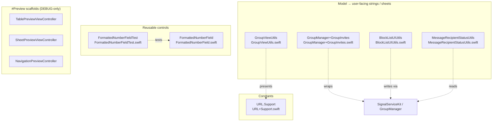

# SignalUI — `Utils/` module

This documentation set covers the **UI utilities** directory
[`SignalUI/Utils/`](../../../SignalUI/Utils/) (10 Swift files, ~7.9k bytes to
19k bytes each). Unlike a single cohesive subsystem, this folder is a grab-bag
of small, independent helpers that sit *between* the generic SignalUI view
layer and the `SignalServiceKit` data/business layer. Each helper either:

- maps `SignalServiceKit` model state (`TSOutgoingMessage`, `TSThread`,
  `TSGroupThread`, `TSPaymentModel`) into user-facing UI strings and action
  sheets, or
- provides a reusable, model-agnostic UI control / `#Preview` scaffold.

> **Confidence labels.** Each claim is tagged with a confidence level:
> - **[High]** — directly read from source in `SignalUI/Utils/`; behavior is
>   explicit in the code.
> - **[Medium]** — inferred from code with reasonable certainty, but depends on
>   collaborators defined outside `SignalUI/Utils/` (e.g. `SSKEnvironment`,
>   `GroupManager`, `OWSLocalizedString`, `ModalActivityIndicatorViewController`).
> - **[Low]** — inferred from naming/comments/doc-comments; not fully verified
>   in-tree.
>
> Where the source gives no evidence for a design question, the text says
> **"intent undetermined — no evidence in source"** rather than guessing.
>
> **Citations** are given as `File.swift:line` relative to the repository root,
> pointing at the definition being described. Line numbers reflect the state of
> the tree at authoring time and may drift as code changes; use the cited symbol
> name to re-locate code if lines have moved.

## File catalog

Every first-party file in `SignalUI/Utils/`, with a one-line summary and the
category it belongs to.

| File | Public entry point | Category | Summary |
| --- | --- | --- | --- |
| `URL+Support.swift` | `URL.Support` | Constants | Namespaced catalog of Signal support-center article URLs. **[High]** (`SignalUI/Utils/URL+Support.swift:6-7`) |
| `MessageRecipientStatusUtils.swift` | `MessageRecipientStatusUtils`, `MessageReceiptStatus` | Model→string | Maps outgoing-message / recipient / payment state to localized receipt-status strings. **[High]** (`SignalUI/Utils/MessageRecipientStatusUtils.swift:8-20`) |
| `BlockListUIUtils.swift` | `BlockListUIUtils` | Model→action sheet | Block/unblock confirmation action sheets for contacts, groups, and release-notes threads. **[High]** (`SignalUI/Utils/BlockListUIUtils.swift:8-12`) |
| `GroupViewUtils.swift` | `GroupViewUtils` | Model→string + modal | Group-member labels, member-name previews, and update-with-activity-indicator helpers. **[High]** (`SignalUI/Utils/GroupViewUtils.swift:11`) |
| `GroupManager+GroupInvites.swift` | `GroupManager` (extension) | Model + modal | UI-driven leave-group / accept-invite flows wrapped in a modal activity indicator. **[High]** (`SignalUI/Utils/GroupManager+GroupInvites.swift:9`) |
| `FormattedNumberField.swift` | `FormattedNumberField` | Reusable control | Auto-formatting / input-restriction logic for a `UITextField`/`UITextView`. **[High]** (`SignalUI/Utils/FormattedNumberField.swift:19`) |
| `FormattedNumberFieldTest.swift` | `FormattedNumberFieldTest` | Test | `XCTestCase` exercising `FormattedNumberField`'s delete/insert logic. **[High]** (`SignalUI/Utils/FormattedNumberFieldTest.swift:9`) |
| `TablePreviewViewController.swift` | `TablePreviewViewController` | `#Preview` scaffold (DEBUG) | Minimal `UITableViewController` for Xcode `#Preview`s. **[High]** (`SignalUI/Utils/TablePreviewViewController.swift:8-12`) |
| `SheetPreviewViewController.swift` | `SheetPreviewViewController` | `#Preview` scaffold (DEBUG) | Harness that presents a sheet from a button for previews. **[High]** (`SignalUI/Utils/SheetPreviewViewController.swift:8-9`) |
| `NavigationPreviewController.swift` | `NavigationPreviewController` | `#Preview` scaffold (DEBUG) | `OWSNavigationController` subclass that pushes a VC for previews. **[High]** (`SignalUI/Utils/NavigationPreviewController.swift:8-9`) |

## Module responsibility & shape

The folder has **no shared base class or protocol** tying the files together;
each is a standalone `public` entry point. Five of the ten files import
`SignalServiceKit` directly to reach model types and the shared service
container `SSKEnvironment`. **[High]**
(`SignalUI/Utils/MessageRecipientStatusUtils.swift:6`,
`SignalUI/Utils/BlockListUIUtils.swift:6`,
`SignalUI/Utils/GroupViewUtils.swift:8`,
`SignalUI/Utils/GroupManager+GroupInvites.swift:7`,
`SignalUI/Utils/FormattedNumberField.swift:7`)

---

## 1. `URL+Support.swift` — support-article URL catalog

`URL+Support.swift` adds a nested `public enum Support` to `URL` holding
`static let` constants for every Signal support-center article the UI links to
(backups, debug logs, delivery issues, groups, linked devices, PINs, proxies,
safety numbers, key transparency, etc.). **[High]**
(`SignalUI/Utils/URL+Support.swift:7-24`)

- Donation- and payment-specific articles are grouped into further nested enums
  `Support.Donations` and `Support.Payments`. **[High]**
  (`SignalUI/Utils/URL+Support.swift:26-43`)
- All constants are built through a single private factory
  `supportArticle(_ slug:)` that interpolates the slug into
  `https://support.signal.org/hc/articles/<slug>`; `generic` is the sole
  hand-written exception pointing at `https://support.signal.org`. **[High]**
  (`SignalUI/Utils/URL+Support.swift:12`, `SignalUI/Utils/URL+Support.swift:45-47`)
- Some slugs carry URL fragments (e.g. `360007319011#ipad_contacts`,
  `360031949872#fix`) so a single article page can deep-link to a section.
  **[High]** (`SignalUI/Utils/URL+Support.swift:9`,
  `SignalUI/Utils/URL+Support.swift:27`)

This file is a pure constants table; the `force-unwrap` of the `URL(string:)`
initializers is deliberate because the inputs are compile-time literals.
**[Medium]** (`SignalUI/Utils/URL+Support.swift:12`,
`SignalUI/Utils/URL+Support.swift:46`)

An example consumer in this same folder: `GroupViewUtils` opens
`URL.Support.groups` in an `SFSafariViewController`. **[High]**
(`SignalUI/Utils/GroupViewUtils.swift:131-132`)

---

## 2. `MessageRecipientStatusUtils.swift` — receipt-status mapping

Defines the `public enum MessageReceiptStatus: Int` (`uploading`, `sending`,
`sent`, `delivered`, `read`, `viewed`, `failed`, `skipped`, `pending`) and the
stateless utility class `MessageRecipientStatusUtils` (private initializer — not
meant to be instantiated). **[High]**
(`SignalUI/Utils/MessageRecipientStatusUtils.swift:8-18`,
`SignalUI/Utils/MessageRecipientStatusUtils.swift:20-22`)

Two granularities of status computation:

- **Per-recipient**: `recipientStatusAndStatusMessage(outgoingMessage:recipientState:…)`
  switches on `recipientState.status` and returns a tuple of
  `(status, shortStatusMessage, longStatusMessage)`. It has a convenience
  overload that reads `hasBodyAttachments` from a `DBReadTransaction` and one
  that takes the boolean directly. **[High]**
  (`SignalUI/Utils/MessageRecipientStatusUtils.swift:25-37`,
  `SignalUI/Utils/MessageRecipientStatusUtils.swift:39-106`)
- **Per-message**: `receiptStatusAndMessage(outgoingMessage:…)` switches on
  `outgoingMessage.messageState`, and for the `.sent` case it refines the status
  to `.viewed` / `.read` / `.delivered` by inspecting
  `viewedRecipientAddresses()`, `readRecipientAddresses()`, and
  `wasDeliveredToAnyRecipient`. **[High]**
  (`SignalUI/Utils/MessageRecipientStatusUtils.swift:108-164`)

String resolution details:

- `.sent` / `.delivered` / `.read` / `.viewed` statuses embed a relative
  timestamp via `DateUtil.formatPastTimestampRelativeToNow(...)`, using the
  message `timestamp` for `.sent` and the recipient `statusTimestamp` for the
  later states. **[High]**
  (`SignalUI/Utils/MessageRecipientStatusUtils.swift:73-106`)
- `.sending` splits into `.uploading` vs `.sending` depending on
  `hasBodyAttachments`, with `assert(outgoingMessage.messageState == .sending)`.
  **[High]** (`SignalUI/Utils/MessageRecipientStatusUtils.swift:51-72`)
- The `default` branch of the per-message switch logs `owsFailDebug(...)` and
  falls back to `.sent`. **[High]**
  (`SignalUI/Utils/MessageRecipientStatusUtils.swift:159-164`)

Payments integration:

- A `recipientStatus(outgoingMessage:paymentModel:)` overload and the
  `@objc receiptMessage(outgoingMessage:paymentModel:)` method both delegate to
  `TSPaymentState.combinedMessageReceiptStatus(with:)`. **[High]**
  (`SignalUI/Utils/MessageRecipientStatusUtils.swift:182-187`,
  `SignalUI/Utils/MessageRecipientStatusUtils.swift:189-242`)
- The file extends `TSPaymentState` with a `messageReceiptStatus` computed
  property and a `fileprivate combinedMessageReceiptStatus(with:)` that merges
  payment state with `TSOutgoingMessage.messageState`, then upgrades
  `.sent`/`.delivered` to `.viewed`/`.read` when recipient receipts exist.
  **[High]** (`SignalUI/Utils/MessageRecipientStatusUtils.swift:267-333`)
- `description(forMessageReceiptStatus:)` returns a non-localized debug string
  for each enum case. **[High]**
  (`SignalUI/Utils/MessageRecipientStatusUtils.swift:243-266`)

Cross-reference: the payment-state semantics mapped here are defined in
SignalServiceKit — see
[docs/SignalServiceKit/Payments/payment-model-and-state-machine.md](../../SignalServiceKit/Payments/payment-model-and-state-machine.md).
The outgoing-message send lifecycle these statuses track is documented in
[docs/SignalServiceKit/Messages/README.md](../../SignalServiceKit/Messages/README.md). **[Medium]**

---

## 3. `BlockListUIUtils.swift` — block / unblock action sheets

A stateless utility class (private initializer) that drives the user-facing
block/unblock confirmation flows. The only exported callback type is
`public typealias Completion = (_ isBlocked: Bool) -> Void`. **[High]**
(`SignalUI/Utils/BlockListUIUtils.swift:8-12`)

Dispatch by thread type:

- `showBlockThreadActionSheet(_:from:completion:)` branches on the concrete
  thread subclass — `TSContactThread` → address flow, `TSGroupThread` → group
  flow, `TSReleaseNotesThread` → release-notes flow — and `owsFailDebug`s for an
  unexpected type. `showUnblockThreadActionSheet(...)` mirrors this. **[High]**
  (`SignalUI/Utils/BlockListUIUtils.swift:18-40`,
  `SignalUI/Utils/BlockListUIUtils.swift:274-300`)
- Blocking yourself is explicitly rejected: a local address shows a
  "can't block yourself" alert and calls back with `false`. **[High]**
  (`SignalUI/Utils/BlockListUIUtils.swift:67-88`)

Model writes:

- `blockAddress`, `blockGroup`, and `blockReleaseNotesThread` perform the actual
  state change through `SSKEnvironment.shared.blockingManagerRef` inside a
  `databaseStorageRef` write transaction (release-notes uses
  `DependenciesBridge.shared.db`). **[High]**
  (`SignalUI/Utils/BlockListUIUtils.swift:201-215`,
  `SignalUI/Utils/BlockListUIUtils.swift:216-256`,
  `SignalUI/Utils/BlockListUIUtils.swift:258-272`)
- Blocking a group also eagerly leaves it: `blockGroup` calls
  `GroupManager.localLeaveGroupOrDeclineInvite(...)` for members, and an in-code
  comment notes the leave message is durably enqueued and may take up to 24
  hours to complete. **[High]**
  (`SignalUI/Utils/BlockListUIUtils.swift:217-256`,
  `SignalUI/Utils/BlockListUIUtils.swift:234-235`)
- Unblock counterparts (`unblockAddress`, `unblockGroup`,
  `unblockReleaseNotes`) call the corresponding `remove…` methods with
  `wasLocallyInitiated: true`. **[High]**
  (`SignalUI/Utils/BlockListUIUtils.swift:400-464`)

All alerts are built with `ActionSheetController` / `ActionSheetAction` and
`OWSLocalizedString`, funneled through a shared `showOkActionSheet(...)` helper
for the simple confirmation case. **[High]**
(`SignalUI/Utils/BlockListUIUtils.swift:466-479`)

Cross-reference: the `blockingManager` and group-leave machinery live in
SignalServiceKit — see
[docs/SignalServiceKit/Groups/README.md](../../SignalServiceKit/Groups/README.md)
and the durable-queue model in
[docs/SignalServiceKit/Jobs/README.md](../../SignalServiceKit/Jobs/README.md)
(the "durably enqueued" leave-group work). **[Medium]**

---

## 4. `GroupViewUtils.swift` — group label/preview and update modal

A stateless utility class with five public helpers:

- `formatGroupMembersLabel(memberCount:isTerminated:)` picks a plural-aware
  `OWSLocalizedString` format (former-members title when terminated, otherwise
  member-count label) and formats with `String.localizedStringWithFormat`.
  **[High]** (`SignalUI/Utils/GroupViewUtils.swift:13-30`)
- `membersNamesPreview(for:tx:)` builds a localized comma-separated member list
  via `SSKEnvironment.shared.contactManagerRef.sortedComparableNames(...)`,
  excludes the local user from the sorted names but appends `CommonStrings.you`
  at the end if present, then joins with `ListFormatter.localizedString(byJoining:)`.
  **[High]** (`SignalUI/Utils/GroupViewUtils.swift:32-48`)
- `updateGroupWithActivityIndicator(fromViewController:updateBlock:completion:)`
  (`@MainActor`) presents a `ModalActivityIndicatorViewController`, waits on
  `GroupManager.waitForMessageFetchingAndProcessingWithTimeout()`, runs the
  async `updateBlock`, and on error routes to `showUpdateErrorUI(error:)` after
  `owsFailDebugUnlessNetworkFailure`. **[High]**
  (`SignalUI/Utils/GroupViewUtils.swift:50-77`)
- `showUpdateErrorUI(error:)` chooses the alert copy by error kind: network
  failure/timeout, `GroupsV2Error.terminatedGroup`, or a generic
  "update failed." **[High]** (`SignalUI/Utils/GroupViewUtils.swift:78-110`)
- `showInvalidGroupMemberAlert(fromViewController:)` offers a "Learn more"
  action that opens `URL.Support.groups` in an `SFSafariViewController` via the
  private `showCantAddMemberView`. **[High]**
  (`SignalUI/Utils/GroupViewUtils.swift:111-133`)

A pre-existing `// GroupsV2 TODO:` comment inside `updateGroupWithActivityIndicator`
asks whether cancel should be allowed; this is source code, not a documentation
placeholder. **[High]** (`SignalUI/Utils/GroupViewUtils.swift:55`)

---

## 5. `GroupManager+GroupInvites.swift` — UI-driven leave/accept flows

A `public extension GroupManager` (not a new type) adding two `@MainActor`
methods that pair a model operation with modal UI. **[High]**
(`SignalUI/Utils/GroupManager+GroupInvites.swift:9`)

- `leaveGroupOrDeclineInviteAsyncWithUI(groupThread:fromViewController:replacementAdminAci:success:)`
  asserts local membership, presents a non-cancelable
  `ModalActivityIndicatorViewController`, performs
  `localLeaveGroupOrDeclineInvite(...)` inside `awaitableWrite`, awaits the
  resulting promise, and shows a `LEAVE_GROUP_FAILED` action sheet on error.
  In-code comments note that join requests are *not* handled here and that the
  method is a no-op if you aren't a member. **[High]**
  (`SignalUI/Utils/GroupManager+GroupInvites.swift:11-53`)
- `acceptGroupInviteWithModal(_:fromViewController:)` (async, throwing) requires
  a `TSGroupModelV2` (throws `OWSAssertionError` otherwise), calls
  `localAcceptInviteToGroupV2(secretParams:waitForMessageProcessing:)` through
  `ModalActivityIndicatorViewController.presentAndPropagateResult`, and surfaces
  a `GROUPS_INVITE_ACCEPT_INVITE_FAILED` action sheet before re-throwing.
  **[High]** (`SignalUI/Utils/GroupManager+GroupInvites.swift:55-79`)

This file imports `LibSignalClient` for the `Aci` type used by
`replacementAdminAci`. **[High]**
(`SignalUI/Utils/GroupManager+GroupInvites.swift:6`,
`SignalUI/Utils/GroupManager+GroupInvites.swift:15`)

Cross-reference: the underlying `GroupManager.localLeaveGroupOrDeclineInvite` /
`localAcceptInviteToGroupV2` operations and the GroupsV2 state model are
documented in
[docs/SignalServiceKit/Groups/gv2-operations.md](../../SignalServiceKit/Groups/gv2-operations.md).
**[Medium]**

---

## 6. `FormattedNumberField.swift` — auto-formatting text-field logic

A stateless `public enum FormattedNumberField` (used purely as a namespace)
containing the logic to auto-format and input-restrict a `UITextField` or
`UITextView` — e.g. credit-card-number formatting. The doc comment explicitly
notes it could be made more generic but is "good enough." **[High]**
(`SignalUI/Utils/FormattedNumberField.swift:11-19`)

Supporting types:

- `struct OperationResult { formattedString; cursorPosition }` — the result of a
  single edit. **[High]** (`SignalUI/Utils/FormattedNumberField.swift:20-23`)
- `enum SingleDeletionDirection { backward; forward }`. **[High]**
  (`SignalUI/Utils/FormattedNumberField.swift:25-28`)
- `public struct AllowedCharacters` bundling a `UIKeyboardType` with a character
  filter, with two presets: `.numbers` (ASCII digits, `.asciiCapableNumberPad`)
  and `.alphanumeric` (ASCII alphanumerics, `.asciiCapable`). **[High]**
  (`SignalUI/Utils/FormattedNumberField.swift:30-50`)

Entry point and algorithm:

- `textField(_:shouldChangeCharactersIn:replacementString:allowedCharacters:maxCharacters:format:)`
  is meant to be called from the `UITextFieldDelegate` method; it detects a
  single-character deletion vs an insert/replace, applies the change, rewrites
  the field's `safeText`, repositions the cursor, and always returns `false`.
  **[High]** (`SignalUI/Utils/FormattedNumberField.swift:77-151`)
- The core cursor math is in two private helpers: `unformattedPosition(...)` maps
  a cursor position in the formatted string to its position in the unformatted
  string, and `formattedPosition(...)` maps back, returning `(lower, upper)`
  bounds because the mapping is ambiguous at group boundaries. **[High]**
  (`SignalUI/Utils/FormattedNumberField.swift:153-242`)
- `singleDelete(...)` handles deletions across formatting boundaries (deleting
  "backward" vs "forward" removes different source digits), and `insertOrReplace(...)`
  handles insertion/replacement, filtering disallowed characters, uppercasing,
  and enforcing `maxCharacters` only when the edit *further* exceeds the limit.
  **[High]** (`SignalUI/Utils/FormattedNumberField.swift:244-315`,
  `SignalUI/Utils/FormattedNumberField.swift:316-375`)
- The `public protocol TextInput: UITextInput { var safeText: String }` abstracts
  the backing control; both `UITextField` and `UITextView` are conformed to it
  with a nil-coalescing `safeText`. **[High]**
  (`SignalUI/Utils/FormattedNumberField.swift:377-393`)

---

## 7. `FormattedNumberFieldTest.swift` — unit tests for the field logic

An `XCTestCase` under `@testable import SignalUI` that exercises
`FormattedNumberField`'s abstract `singleDelete` / `insertOrReplace` operations.
**[High]** (`SignalUI/Utils/FormattedNumberFieldTest.swift:6-9`)

- A helper `struct TestState` is `ExpressibleByStringLiteral`, decoding `|`
  (collapsed cursor) and `[` … `]` (selection) markers out of concise literal
  strings so test cases read like `"1234| "`. **[High]**
  (`SignalUI/Utils/FormattedNumberFieldTest.swift:11-61`)
- `testSingleDelete()` covers both no-op cases and backward/forward deletion
  cases, including deletions straddling the formatting space. **[High]**
  (`SignalUI/Utils/FormattedNumberFieldTest.swift:63-109`)
- `testNumericInsert()` and `testAlphanumericInsert()` cover insertion,
  replacement of a selection, filtering of disallowed characters, and the
  `maxCharacters` limit, for `.numbers` and `.alphanumeric` respectively.
  **[High]** (`SignalUI/Utils/FormattedNumberFieldTest.swift:110-174`,
  `SignalUI/Utils/FormattedNumberFieldTest.swift:175-237`)
- A local `testFormat` helper inserts a space after every 4 characters, standing
  in for a real formatter. **[High]**
  (`SignalUI/Utils/FormattedNumberFieldTest.swift:49-61`)

This is the only test file in `SignalUI/Utils/`; it is the companion to
`FormattedNumberField.swift` (§6). **[High]**
(`SignalUI/Utils/FormattedNumberFieldTest.swift:7`)

---

## 8–10. `#Preview` scaffolds (DEBUG-only)

Three small view controllers exist solely to host Xcode `#Preview`s and are each
wrapped in `#if DEBUG`, so they are excluded from release builds. **[High]**
(`SignalUI/Utils/TablePreviewViewController.swift:8`,
`SignalUI/Utils/SheetPreviewViewController.swift:8`,
`SignalUI/Utils/NavigationPreviewController.swift:8`)

### `TablePreviewViewController.swift`

An `open class TablePreviewViewController: UITableViewController` whose doc
comment states it is "A minimal `UITableViewController` for displaying
`UITableViewCell`s in Xcode `#Previews`." It is initialized with a
`cellBlock: (UITableView) -> [UITableViewCell]` closure, materializes the cells
in `viewDidLoad`, and serves them from the standard data-source methods;
`init(coder:)` is marked `@available(*, unavailable)`. The file ends with an
`@available(iOS 17, *) #Preview` that renders five rows. **[High]**
(`SignalUI/Utils/TablePreviewViewController.swift:10-45`,
`SignalUI/Utils/TablePreviewViewController.swift:46-57`)

### `SheetPreviewViewController.swift`

A `public class SheetPreviewViewController: UIViewController` that shows a
"Present Sheet" button and (re)presents a sheet. Presentation is modeled by a
private `enum PresentAction` with `.createSheet` and `.presentSheet` cases, and
three `public init`s let callers supply either a sheet factory
(`createSheet` / `sheet` autoclosure) or a custom `presentSheet` closure. The
sheet is presented in `viewDidAppear`, optionally animated on first appearance.
**[High]** (`SignalUI/Utils/SheetPreviewViewController.swift:9-57`,
`SignalUI/Utils/SheetPreviewViewController.swift:62-80`)

### `NavigationPreviewController.swift`

A `public class NavigationPreviewController: OWSNavigationController` that pushes
a placeholder root `UIViewController` at init time (so there is something to push
over) and then pushes the supplied `viewController` in `viewDidAppear`,
optionally animated on first appearance. **[High]**
(`SignalUI/Utils/NavigationPreviewController.swift:9-27`)

These three files have no dependencies on `SignalServiceKit`; they import only
`UIKit` (and, for the navigation case, build on SignalUI's own
`OWSNavigationController`). **[High]**
(`SignalUI/Utils/TablePreviewViewController.swift:6`,
`SignalUI/Utils/SheetPreviewViewController.swift:6`,
`SignalUI/Utils/NavigationPreviewController.swift:6`,
`SignalUI/Utils/NavigationPreviewController.swift:9`)

---

## Related modules

- **Parent module overview:**
  [docs/SignalUI/README.md](../README.md) — the SignalUI framework these helpers
  belong to. **[Medium]**
- **View controllers / views** that consume these helpers:
  [docs/SignalUI/ViewControllers.md](../ViewControllers.md),
  [docs/SignalUI/Views.md](../Views.md). **[Medium]**
- **Message send lifecycle** (status mapped by `MessageRecipientStatusUtils`):
  [docs/SignalServiceKit/Messages/README.md](../../SignalServiceKit/Messages/README.md). **[Medium]**
- **Payments model/state** (mapped via `TSPaymentState`):
  [docs/SignalServiceKit/Payments/payment-model-and-state-machine.md](../../SignalServiceKit/Payments/payment-model-and-state-machine.md). **[Medium]**
- **Groups** (leave/accept operations invoked by `GroupManager+GroupInvites` and
  `BlockListUIUtils`):
  [docs/SignalServiceKit/Groups/gv2-operations.md](../../SignalServiceKit/Groups/gv2-operations.md),
  [docs/SignalServiceKit/Groups/README.md](../../SignalServiceKit/Groups/README.md). **[Medium]**
- **Durable job queue** (the "durably enqueued" leave-group work referenced by
  `BlockListUIUtils.blockGroup`):
  [docs/SignalServiceKit/Jobs/README.md](../../SignalServiceKit/Jobs/README.md). **[Medium]**
