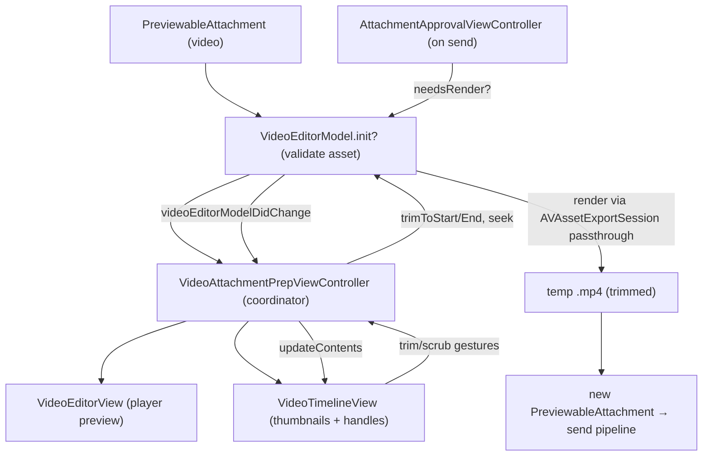

# Video Editor: trim UI and passthrough export

Source: `SignalUI/VideoEditor/`. This subsystem implements the **video trimming
editor** shown inside the attachment-approval flow: a player preview, a
scrubbable/trimmable timeline, and the logic that exports a trimmed clip when the
user sends. It covers "preview a video → optionally trim start/end → render the
trimmed range to a new file at send time."

> Confidence: **[High]** read in full; **[Medium]** signature/partial or depends
> on collaborators outside this folder; **[Low]** inferred from naming/comments.
> Citations are `File.swift:line`. An uncited claim is a defect.

The folder has four files:

- `VideoEditorModel.swift` — the trim/export model (state + rendering).
- `VideoEditorView.swift` — the player preview view and playback control.
- `VideoTimelineView.swift` — the thumbnail-strip timeline with trim handles,
  scrubbing cursor, and time bubble.
- `VideoAttachmentPrepViewController.swift` — the coordinator that wires model,
  editor view, and timeline together inside the approval pager.

## The model (`VideoEditorModel.swift`)

**[High]** `VideoEditorModel` is the (non-`@MainActor`, with a `// Should be
@MainActor.` note) reference type that owns trim state and performs export
(`SignalUI/VideoEditor/VideoEditorModel.swift:16`). Its failable/throwing
initializer takes a `PreviewableAttachment` and **refuses non-videos and looping
videos** by returning `nil` (`SignalUI/VideoEditor/VideoEditorModel.swift:57-60`).
It opens the file as an `AVURLAsset` and validates the asset before accepting it:

- **[High]** Duration must be positive
  (`SignalUI/VideoEditor/VideoEditorModel.swift:66-69`).
- **[High]** There must be a video track with a positive `naturalSize`, from
  which a `displaySize` is derived by applying the track's `preferredTransform`
  (so rotated videos display correctly)
  (`SignalUI/VideoEditor/VideoEditorModel.swift:71-85`).
- **[High]** The asset must be `isPlayable`, `isExportable`, `isReadable`, and
  must **not** have protected content; otherwise it throws
  (`SignalUI/VideoEditor/VideoEditorModel.swift:87-93`). The initializer comment
  states videos are not editable when invalid or when size/aspect-ratio cannot be
  determined (`SignalUI/VideoEditor/VideoEditorModel.swift:52-55`).

### Trim state

**[High]** Trim bounds are stored as `trimmedStartSeconds` /
`trimmedEndSeconds` (initialized to `0` and the full duration)
(`SignalUI/VideoEditor/VideoEditorModel.swift:28-32`, `:95-99`). Derived state:

- `trimmedDurationSeconds` is the clamped span between the two bounds
  (`SignalUI/VideoEditor/VideoEditorModel.swift:24-26`).
- `canBeTrimmed` requires the untrimmed duration to exceed the minimum
  (`SignalUI/VideoEditor/VideoEditorModel.swift:44-46`); `minimumDurationSeconds`
  is `1` (`SignalUI/VideoEditor/VideoEditorModel.swift:34`).
- `isTrimmed` is true when either bound has moved off the full-video extent
  (`SignalUI/VideoEditor/VideoEditorModel.swift:48-50`).

**[High]** `trimToStartSeconds(_:)` and `trimToEndSeconds(_:)` clamp the requested
value so the trimmed clip can never be shorter than `minimumDurationSeconds`, then
fire a change notification (`SignalUI/VideoEditor/VideoEditorModel.swift:101-124`).

**[High]** Observation is a hand-rolled weak-observer list:
`VideoEditorModelObserver.videoEditorModelDidChange(_:)` is the single callback
(`SignalUI/VideoEditor/VideoEditorModel.swift:9-11`), observers are stored as
`[Weak<VideoEditorModelObserver>]`
(`SignalUI/VideoEditor/VideoEditorModel.swift:131`), and `fireModelDidChange()`
notifies all live observers (`SignalUI/VideoEditor/VideoEditorModel.swift:135-143`).

### Rendering / export

**[High]** `needsRender` is simply `isTrimmed` — an untrimmed video needs no
re-encode (`SignalUI/VideoEditor/VideoEditorModel.swift:147`). `render()` is
`@MainActor async throws -> URL` with a precondition that `needsRender` is true
(`SignalUI/VideoEditor/VideoEditorModel.swift:149-152`). Notable media choices:

- **[High]** It uses `AVAssetExportSession` with
  `AVAssetExportPresetPassthrough`, i.e. **no re-encode** — the trimmed range is
  copied, preserving the original codec/quality
  (`SignalUI/VideoEditor/VideoEditorModel.swift:162`).
- **[High]** `shouldOptimizeForNetworkUse = true` moves the MP4 `moov` atom to the
  front of the file; the inline comment says this may help recipients validate
  incoming videos (`SignalUI/VideoEditor/VideoEditorModel.swift:166-169`).
- **[High]** The export `timeRange` is built from the trimmed bounds using the
  **original timescale** (`CMTime(seconds:preferredTimescale:)` with
  `untrimmedDuration.timescale`), per the "preserve the original timescale"
  comment (`SignalUI/VideoEditor/VideoEditorModel.swift:170-174`).
- **[High]** Output goes to a temporary `.mp4` file that is **not** available while
  the device is locked (`SignalUI/VideoEditor/VideoEditorModel.swift:157-161`), and
  export is awaited via `session.exportAsync(to:as:)`
  (`SignalUI/VideoEditor/VideoEditorModel.swift:176`).
- **[High]** On completion it returns the URL; `.cancelled` maps to a
  `CancellationError`, and any other status rethrows the session error
  (`SignalUI/VideoEditor/VideoEditorModel.swift:182-189`). Export duration is
  logged (`SignalUI/VideoEditor/VideoEditorModel.swift:178-180`).

## The player view (`VideoEditorView.swift`)

**[High]** `VideoEditorView` is a `UIView` conforming to
`AttachmentPrepContentView`, `VideoPlaybackState`, and `VideoPlayerViewDelegate`
(`SignalUI/VideoEditor/VideoEditorView.swift:19`). It wraps a `VideoPlayerView`
backed by `VideoPlayer(decryptedFileUrl:)` pointed at the model's source path
(`SignalUI/VideoEditor/VideoEditorView.swift:30-35`) and overlays a round play
button (`SignalUI/VideoEditor/VideoEditorView.swift:37-54`).

- **[High]** It communicates playback-time changes back out through
  `VideoEditorViewDelegate.videoEditorViewPlaybackTimeDidChange(_:)`
  (`SignalUI/VideoEditor/VideoEditorView.swift:11-13`,
  `:280`). **[Low]** `VideoEditorViewControllerProviding` lets the view obtain a
  presenting `UIViewController` (`SignalUI/VideoEditor/VideoEditorView.swift:15-17`).
- **[High]** `configureSubviews()` pins the player with constraints that emulate
  `contentMode = .scaleAspectFit` using the model's `displaySize` aspect ratio
  (`SignalUI/VideoEditor/VideoEditorView.swift:78`).
- **[High]** `AttachmentPrepContentView` conformance supplies animatable rounded
  corners (`setHasRoundedCorners(_:animationDuration:)`), with a radius that
  differs on iOS 26+ (`SignalUI/VideoEditor/VideoEditorView.swift:145`, `:154`).
- **[High]** `ensureSeekReflectsTrimming()` keeps the playhead inside the trimmed
  range: if the cursor is before `trimmedStart` or within `0.1s` of
  `trimmedEnd`, it seeks back to the trimmed start
  (`SignalUI/VideoEditor/VideoEditorView.swift:212-230`). Playback that reaches
  `trimmedEnd` is stopped in the player delegate so the clip never runs past the
  trim end (`SignalUI/VideoEditor/VideoEditorView.swift:269-282`). The
  `isTrimmingVideo` flag suppresses that delegate logic while a trim gesture is
  moving the playhead (`SignalUI/VideoEditor/VideoEditorView.swift:27`, `:272-274`).

## The timeline (`VideoTimelineView.swift`)

**[High]** `VideoTimelineView` is a `UIView` that renders the thumbnail strip, the
yellow trim frame with handle images, a playback cursor, and a floating time
bubble (`SignalUI/VideoEditor/VideoTimelineView.swift:27`). It talks to its owner
through two protocols:

- `VideoTimelineViewDataSource` (extends `VideoEditorDataSource` and
  `VideoPlaybackState`) exposes `videoThumbnails` and `videoAspectRatio`
  (`SignalUI/VideoEditor/VideoTimelineView.swift:8-14`).
- `VideoTimelineViewDelegate` reports trim-begin/`didTrimBeginningTo`/
  `didTrimEndTo`/trim-end and scrub-begin/`didScrubTo`/scrub-end events
  (`SignalUI/VideoEditor/VideoTimelineView.swift:15-26`).

Interaction and rendering details:

- **[High]** A single `PermissiveGestureRecognizer` drives all interaction
  (`SignalUI/VideoEditor/VideoTimelineView.swift:170`); a private `UserInteraction`
  enum (`none`/`trimmingStart`/`trimmingEnd`/`scrubbing`) tracks the current mode
  (`SignalUI/VideoEditor/VideoTimelineView.swift:45-56`).
  `interactionForNewGesture(_:)` classifies the touch into a trim-start, trim-end,
  or scrub using hot-area padding, preferring trimming over scrubbing and
  disambiguating when both handles are in range
  (`SignalUI/VideoEditor/VideoTimelineView.swift:388`).
- **[High]** `applyGestureInProgress(_:)` converts the touch x-position into a
  time offset and enforces the minimum-duration guard **again at the view layer**
  using `VideoEditorModel.minimumDurationSeconds` before notifying the delegate
  (`SignalUI/VideoEditor/VideoTimelineView.swift:436`, `:455`, `:461`).
- **[High]** The thumbnail strip is drawn as a row of `CALayer`s whose count is
  chosen so a whole number of near-video-aspect-ratio thumbnails fills the strip
  (`SignalUI/VideoEditor/VideoTimelineView.swift:207`); a `CAShapeLayer` with
  `evenOdd` fill dims the regions outside the trimmed range
  (`SignalUI/VideoEditor/VideoTimelineView.swift:145-146`). `innerTrimRect` maps
  the trim bounds to pixels and `cursorPosition` maps current playback time via
  `inverseLerp`/`lerp` (`SignalUI/VideoEditor/VideoTimelineView.swift:278`,
  `:294`).
- **[High]** The time bubble shows start/end during trimming and current time
  during scrubbing (`SignalUI/VideoEditor/VideoTimelineView.swift:533`), formatted
  via `OWSFormat.localizedDurationString(from:)`
  (`SignalUI/VideoEditor/VideoTimelineView.swift:582`). The view extends its touch
  "hot area" past its visible bounds via `point(inside:with:)`
  (`SignalUI/VideoEditor/VideoTimelineView.swift:183`).
- **[High]** `TrimFrameView` (handle images + yellow frame) and
  `TimelineCursorView` are private nested `UIView` subclasses
  (`SignalUI/VideoEditor/VideoTimelineView.swift:605`, `:683`). Several visual
  constants (corner radius, blur vs. glass effect) branch on iOS 26+
  (`SignalUI/VideoEditor/VideoTimelineView.swift:58-62`, `:76`).

## The coordinator (`VideoAttachmentPrepViewController.swift`)

**[High]** `VideoAttachmentPrepViewController` subclasses
`AttachmentPrepViewController` (defined in the approval subsystem) and is the hub
that implements *every* delegate/data-source protocol in this folder:
`VideoEditorDataSource`, `VideoEditorModelObserver`, `VideoEditorViewDelegate`,
`VideoPlaybackState`, `VideoTimelineViewDataSource`, `VideoTimelineViewDelegate`,
and `VideoEditorViewControllerProviding`
(`SignalUI/VideoEditor/VideoAttachmentPrepViewController.swift:25-27`). Its class
comment states its job: "Coordinate data transfer between VideoEditorView and
VideoTimelineView" (`SignalUI/VideoEditor/VideoAttachmentPrepViewController.swift:23`).

- **[High]** It is constructed from an `AttachmentApprovalItem` and fails if that
  item has no `videoEditorModel`
  (`SignalUI/VideoEditor/VideoAttachmentPrepViewController.swift:41-50`). It then
  registers itself as a model observer
  (`SignalUI/VideoEditor/VideoAttachmentPrepViewController.swift:51`).
- **[High]** It exposes the `VideoEditorView` as the prep view controller's
  `contentView` and the `VideoTimelineView` as its `toolbarSupplementaryView`
  (`SignalUI/VideoEditor/VideoAttachmentPrepViewController.swift:54-60`).
- **[High]** `canSaveMedia` is overridden to allow saving whenever the model
  `needsRender` (i.e. the clip was trimmed)
  (`SignalUI/VideoEditor/VideoAttachmentPrepViewController.swift:72-77`).
- **[High]** Trim-gesture callbacks forward to the model (`trimToStartSeconds` /
  `trimToEndSeconds`) and seek the editor view; scrubbing callbacks seek the view
  and pause/resume playback around the gesture
  (`SignalUI/VideoEditor/VideoAttachmentPrepViewController.swift:194`, `:214`,
  `:218`). The `videoEditorModelDidChange` observer refreshes the timeline
  (`SignalUI/VideoEditor/VideoAttachmentPrepViewController.swift:226`).

### Thumbnail generation

**[High]** On `prepareContentView()` the controller kicks off asynchronous
thumbnail generation
(`SignalUI/VideoEditor/VideoAttachmentPrepViewController.swift:62`, `:128`). The
worker is a `@concurrent` static function that uses `AVAssetImageGenerator` with
`appliesPreferredTrackTransform = true` and a capped `maximumSize`, sampling evenly
across the untrimmed duration; it generates enough thumbnails for the worst case
(full-screen landscape) to avoid regeneration
(`SignalUI/VideoEditor/VideoAttachmentPrepViewController.swift:154`, `:162`,
`:174`). The results are stored in `videoThumbnails` and the strip is refreshed
(`SignalUI/VideoEditor/VideoAttachmentPrepViewController.swift:79`, `:143-145`).

## Interaction with the rest of SignalUI / the app

**[High]** The editor is created and consumed by the attachment-approval
subsystem, not instantiated directly by the app:

- `AttachmentApprovalItem` builds the `VideoEditorModel` from a
  `PreviewableAttachment` (swallowing construction errors), gating editing to
  valid, non-looping videos
  (`SignalUI/AttachmentApproval/AttachmentItemCollection.swift:37`, `:46`,
  `:64-72`). See [AttachmentFlows.md](../AttachmentFlows.md) for
  `PreviewableAttachment` and the approval UI.
- At send/prepare time, `AttachmentApprovalViewController` checks
  `videoEditorModel.needsRender` and, when true, calls `prepareVideoAttachment(…)`
  which awaits `videoEditorModel.render()`, wraps the resulting file URL in a
  `DataSourcePath`, and rewrites the filename extension to match the output format
  (`SignalUI/AttachmentApproval/AttachmentApprovalViewController.swift:706-710`,
  `:738-745`). The rendered clip then flows into the normal send pipeline as a
  `PreviewableAttachment`.
- The preview/trim UI is hosted by the approval pager via
  `AttachmentPrepViewController`
  (`SignalUI/AttachmentApproval/AttachmentPrepViewController.swift:21`), whose
  `AttachmentPrepContentView` protocol the `VideoEditorView` satisfies
  (`SignalUI/AttachmentApproval/AttachmentPrepViewController.swift:17-19`;
  `SignalUI/VideoEditor/VideoEditorView.swift:19`).

**[Medium]** `VideoPlayerView` / `VideoPlayer`, `OWSLayerView`,
`PermissiveGestureRecognizer`, `OWSFormat`, and `OWSFileSystem` are shared
SignalUI/SSK facilities used but not defined in this folder (referenced from the
files above).

## Data flow (trim → export)

