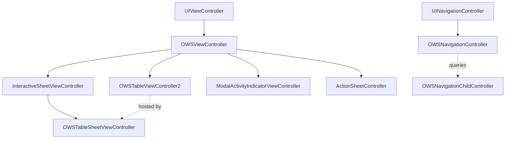

# View Controllers

Source: `SignalUI/ViewControllers/` and `SignalUI/ActionSheets/`. These are the
base classes and presentation primitives most other screens build on. This doc
describes the representative ones.

> Confidence: **[High]** read in full; **[Medium]** signature/partial; **[Low]**
> inferred. Citations are `File.swift:line`. An uncited claim is a defect.

## `OWSViewController` — the base class

**[High]** `OWSViewController` is an `open class` subclass of `UIViewController`
(`SignalUI/ViewControllers/OWSViewController.swift:34`). It provides three
cross-cutting services that nearly every Signal screen relies on:

1. **Lifecycle tracking.** It exposes a `ViewControllerLifecycle` enum
   (`SignalUI/ViewControllers/OWSViewController.swift:8`) and keeps both the
   current `lifecycle` and the set of `achievedLifecycleStates`
   (`SignalUI/ViewControllers/OWSViewController.swift:39-46`), updated from
   `viewDidLoad`/`viewWillAppear`/`viewDidAppear`/`viewWillDisappear`/
   `viewDidDisappear`.
2. **Theme + content-size hooks.** Overridable `themeDidChange()`
   (`SignalUI/ViewControllers/OWSViewController.swift:53`) and
   `contentSizeCategoryDidChange()`
   (`SignalUI/ViewControllers/OWSViewController.swift:60`). It registers for the
   `.themeDidChange` notification in `viewDidLoad()`
   (`SignalUI/ViewControllers/OWSViewController.swift:134-139`) — this is the
   receiving end of the theming propagation described in
   [Appearance.md](Appearance.md).
3. **App-state hooks.** Overridable `appWillEnterForeground()`,
   `appDidBecomeActive()`, `appWillResignActive()`, `appDidEnterBackground()`
   (`SignalUI/ViewControllers/OWSViewController.swift:87-108`), wired up by
   `observeAppState()` (`SignalUI/ViewControllers/OWSViewController.swift:214`),
   which is called from `init()` (`SignalUI/ViewControllers/OWSViewController.swift:69`).

It also manages a keyboard-tracking layout guide (with an explicit pre-iOS-16
fallback layout guide, `SignalUI/ViewControllers/OWSViewController.swift:119-131`).

## `OWSTableViewController2` — declarative tables

**[High]** `OWSTableViewController2` subclasses `OWSViewController` and conforms to
`OWSNavigationChildController`, `OWSTableViewDelegate`, `UITableViewDataSource`,
and `UITableViewDelegate` (`SignalUI/ViewControllers/OWSTableViewController2.swift:16`).
Its design intent is stated in the file comment: a convenient way to build table
views "when performance is not critical", retaining a view model per cell
(`SignalUI/ViewControllers/OWSTableViewController2.swift:11-14`).

The content model is declarative:

- `OWSTableContents` is the top-level container
  (`SignalUI/ViewControllers/OWSTableContents.swift:8`).
- `OWSTableSection` groups items (`SignalUI/ViewControllers/OWSTableSection.swift:9`).
- `OWSTableItem` is a single row with its cell/action closures
  (`SignalUI/ViewControllers/OWSTableItem.swift:10`).

Setting `contents` triggers `applyContents()`
(`SignalUI/ViewControllers/OWSTableViewController2.swift:21-37`). The controller
re-themes itself by overriding `themeDidChange()` → `applyTheme()` + re-apply
contents (`SignalUI/ViewControllers/OWSTableViewController2.swift:182-186`,
`:210`), and supports a `forceDarkMode` flag that re-applies the theme when toggled
(`SignalUI/ViewControllers/OWSTableViewController2.swift:61-69`).

## Navigation

**[High]** `OWSNavigationController` is an `open class` subclass of
`UINavigationController` (`SignalUI/ViewControllers/OWSNavigationController.swift:56`).
It cooperates with the `OWSNavigationChildController` protocol
(`SignalUI/ViewControllers/OWSNavigationController.swift:10`), which lets a pushed
child declare its preferred navigation-bar style, background/tint color overrides,
and whether the bar should be hidden — see the conformance in
`HostingController`/`HostingContainer`
(`SignalUI/SwiftUIExtensions/HostingController.swift`, documented in
[Extensions.md](Extensions.md)). `SheetNavigationController` is a parallel
`UINavigationController` subclass used inside sheets
(`SignalUI/ViewControllers/SheetNavigationController.swift:12`). **[Medium]**

## Sheets & modals

**[High]** `InteractiveSheetViewController` is the base for draggable bottom sheets
(`SignalUI/ViewControllers/InteractiveSheetViewController.swift:8`, an
`OWSViewController` subclass). Specializations include:

- `OWSTableSheetViewController` — an `InteractiveSheetViewController` that hosts an
  `OWSTableViewController2` (`SignalUI/ViewControllers/OWSTableSheetViewController.swift:9`).
- `StackSheetViewController` — a sheet built around a stack view
  (`SignalUI/ViewControllers/StackSheetViewController.swift:21`).
- `NavStackSheetViewController` — `SignalUI/ViewControllers/NavStackSheetViewController.swift`.

**[High]** `ModalActivityIndicatorViewController` is the standard blocking
spinner/modal (`SignalUI/ViewControllers/ModalActivityIndicatorViewController.swift:10`,
an `OWSViewController` subclass).

## Action sheets

**[High]** `ActionSheetController` is a custom (non-UIKit) action sheet that is
itself an `OWSViewController` subclass
(`SignalUI/ActionSheets/ActionSheetController.swift:26`) — Signal uses its own
action-sheet implementation rather than `UIAlertController` so it can theme and
style the sheet consistently. **[Medium]** (reason: the type exists and subclasses
the themed base; the explicit rationale is **intent undetermined — no evidence in
source**.)

**[High]** `OWSActionSheets` is a convenience `enum` of static presenters
(`SignalUI/ActionSheets/OWSActionSheets.swift:7`). `showActionSheet(_:fromViewController:)`
falls back to `CurrentAppContext().frontmostViewController()` when no presenter is
given (`SignalUI/ActionSheets/OWSActionSheets.swift:8-18`), and
`showAndAwaitActionSheet(...)` bridges presentation to `async`/`await` via a
`withCheckedContinuation` tied to the sheet's `onDismiss`
(`SignalUI/ActionSheets/OWSActionSheets.swift:20-31`). These helpers are used
throughout the app and the share extension (e.g. the QR scanner surfaces errors via
`OWSActionSheets.showActionSheet` at
`SignalUI/ViewControllers/ScanQRCodeViewController.swift:458`).

## Permissions, windows, screen lock

- **[High]** `UIViewController+Permissions` adds camera/mic/photo permission
  prompts, e.g. `ows_askForCameraPermissions(callback:)`
  (`SignalUI/ViewControllers/UIViewController+Permissions.swift:12`).
- **[Medium]** `OWSWindow` (`SignalUI/ViewControllers/OWSWindow.swift`),
  `ScreenLockViewController` (`SignalUI/ViewControllers/ScreenLockViewController.swift`;
  subclassed by the share extension's `SAEScreenLockViewController`),
  `SpamCaptchaViewController` (`SignalUI/ViewControllers/SpamCaptchaViewController.swift`),
  and `ScanQRCodeViewController` (`SignalUI/ViewControllers/ScanQRCodeViewController.swift`)
  round out the controller area (read by signature/role only).

