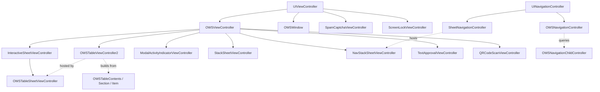

# SignalUI / ViewControllers — subsystem reference

Source: `SignalUI/ViewControllers/`. This directory holds SignalUI's
**view-controller base classes and presentation primitives** — the foundation
layer that the main app and the share extension build concrete screens on top of.
It provides a themed/lifecycle-aware base controller, a declarative table-view
stack, custom navigation, several sheet/modal presentation styles, and a handful
of self-contained utility controllers (permissions prompts, screen lock, captcha,
QR scanning).

This README is a **deep reference for the files in this folder**. For the broader
"how view controllers fit into SignalUI" overview (including `SignalUI/ActionSheets/`),
see the sibling document [../ViewControllers.md](../ViewControllers.md); this doc
intentionally does not duplicate the action-sheets material and instead goes deeper
into the controllers that physically live in `SignalUI/ViewControllers/`.

> Confidence: **[High]** read in full; **[Medium]** signature/partial read or
> dependent on collaborators defined outside this folder; **[Low]** inferred from
> naming/comments. Citations are `File.swift:line`. An uncited factual claim is a
> defect. Where a design *reason* cannot be established from the source, this doc
> says so rather than guessing.

## Responsibility

**[High]** Every file in this directory is a `public`/`open` type (no tests, mocks,
generated protobufs, or asset catalogs are present). The directory's job is to
supply reusable UIKit controller infrastructure:

- a base `UIViewController` with theme, app-state, lifecycle, and keyboard hooks
  (`OWSViewController`);
- a declarative, non-performance-critical table builder
  (`OWSTableViewController2` + `OWSTableContents`/`OWSTableSection`/`OWSTableItem`);
- navigation that can veto back-navigation and drive navbar styling
  (`OWSNavigationController` + `OWSNavigationChildController`);
- several sheet/modal presentations (`InteractiveSheetViewController`,
  `OWSTableSheetViewController`, `StackSheetViewController`,
  `NavStackSheetViewController`, `SheetNavigationController`,
  `ModalActivityIndicatorViewController`);
- an `OWSWindow` that mirrors the app theme onto `overrideUserInterfaceStyle`;
- and leaf-level utility controllers (`UIViewController+Permissions`,
  `ScreenLockViewController`, `SpamCaptchaViewController`, `ScanQRCodeViewController`).

## `OWSViewController` — the base controller

**[High]** `OWSViewController` is an `open class: UIViewController`
(`SignalUI/ViewControllers/OWSViewController.swift:34`). It bundles four
cross-cutting services nearly every Signal screen relies on.

**Lifecycle tracking.** The `ViewControllerLifecycle` enum enumerates
`notLoaded`/`notAppeared`/`willAppear`/`appeared`/`willDisappear`
(`SignalUI/ViewControllers/OWSViewController.swift:8`). The controller exposes the
current `lifecycle` plus a `Set` of `achievedLifecycleStates`
(`SignalUI/ViewControllers/OWSViewController.swift:38-46`); the setter inserts into
the achieved set on each change (`:40-42`). State is advanced from the standard
appearance callbacks: `viewDidLoad` → `.notAppeared`
(`SignalUI/ViewControllers/OWSViewController.swift:115`), `viewWillAppear` →
`.willAppear` (`:145`), `viewDidAppear` → `.appeared` (`:153`), `viewWillDisappear`
→ `.willDisappear` (`:163`), `viewDidDisappear` → `.notAppeared` (`:169`). The enum
also exposes `isLoaded`/`isVisible` convenience predicates
(`SignalUI/ViewControllers/OWSViewController.swift:19-30`).

**Theme + Dynamic Type hooks.** Overridable `themeDidChange()`
(`SignalUI/ViewControllers/OWSViewController.swift:53`) and
`contentSizeCategoryDidChange()`
(`SignalUI/ViewControllers/OWSViewController.swift:60`). `viewDidLoad` subscribes to
`.themeDidChange` (`SignalUI/ViewControllers/OWSViewController.swift:132-137`) — this
is the receiving end of the theming propagation described in
[../Appearance.md](../Appearance.md) — and `observeAppState()` subscribes to
`UIContentSizeCategory.didChangeNotification`
(`SignalUI/ViewControllers/OWSViewController.swift:240-243`).

**App-state hooks.** Overridable `appWillEnterForeground()`,
`appDidBecomeActive()`, `appWillResignActive()`, `appDidEnterBackground()`
(`SignalUI/ViewControllers/OWSViewController.swift:87-108`), wired to the four
`UIApplication` notifications by `observeAppState()`
(`SignalUI/ViewControllers/OWSViewController.swift:214-243`), which is called from
`init()` (`SignalUI/ViewControllers/OWSViewController.swift:69`). The doc comments
explicitly require subclass overrides to call `super`
(`SignalUI/ViewControllers/OWSViewController.swift:85-86`). The default
`appDidBecomeActive()` triggers `setNeedsStatusBarAppearanceUpdate()`
(`SignalUI/ViewControllers/OWSViewController.swift:95`).

**Layout helpers.** `contentLayoutGuide` is a device/orientation-aware static
content area whose margins are recomputed on trait changes
(`SignalUI/ViewControllers/OWSViewController.swift:285`, constraints in
`contentLayoutConstraintsForCurrentTraitCollection()` at `:302-351`, re-applied from
`traitCollectionDidChange` at `:357-366`). A convenience extension
`addStaticContentStackView(arrangedSubviews:isScrollable:shouldAvoidKeyboard:)`
pins a vertical stack to that guide, optionally embedding it in a scroll view and/or
pinning its bottom to the keyboard (`SignalUI/ViewControllers/OWSViewController.swift:486`).

**Keyboard layout guide.** On iOS 16+ `keyboardLayoutGuide` proxies
`view.keyboardLayoutGuide`; on iOS 15 it maintains a manual layout guide driven by
observed keyboard-frame notifications
(`SignalUI/ViewControllers/OWSViewController.swift:379-451`). A `#DEBUG`-only
`ensureNavbarAccessibilityIds()` assigns accessibility identifiers to otherwise
unlabeled navbar controls on each appearance, aiding UI automation
(`SignalUI/ViewControllers/OWSViewController.swift:187`).

## Declarative tables

**[High]** `OWSTableViewController2` is an `open class: OWSViewController` that also
conforms to `OWSNavigationChildController`, `OWSTableViewDelegate`,
`UITableViewDataSource`, and `UITableViewDelegate`
(`SignalUI/ViewControllers/OWSTableViewController2.swift:17`). Its file comment
states the intent: build table views conveniently "when performance is not
critical," retaining a view model per cell
(`SignalUI/ViewControllers/OWSTableViewController2.swift:11-14`). A companion
delegate protocol `OWSTableViewControllerDelegate` exists for scroll callbacks
(`SignalUI/ViewControllers/OWSTableViewController2.swift:9`).

The content model is a small declarative tree, each node a plain reference type:

- `OWSTableContents` — top-level container of sections, with optional title and
  section-index blocks; mutated via `add(_:)`/`add(sections:)`
  (`SignalUI/ViewControllers/OWSTableContents.swift:8`).
- `OWSTableSection` — groups items and carries header/footer configuration (plain
  or attributed titles, custom header/footer views+heights, `hasBackground`,
  `hasSeparators`, separator insets, `shouldDisableCellSelection`)
  (`SignalUI/ViewControllers/OWSTableSection.swift:9`).
- `OWSTableItem` — a single row backed by closures: `customCellBlock` /
  `dequeueCellBlock` build the cell, `willDisplayBlock` configures it, `actionBlock`
  handles taps, and `contextMenuActionProvider` supplies a context menu
  (`SignalUI/ViewControllers/OWSTableItem.swift:10-27`). It ships many convenience
  constructors/factories (`checkmark(...)`, `disclosureItem(...)`, text+accessory
  cells, etc.) (`SignalUI/ViewControllers/OWSTableItem.swift:60-120`).

Assigning `contents` triggers `applyContents()`
(`SignalUI/ViewControllers/OWSTableViewController2.swift:22`, applied via
`applyContents(shouldReload:)` at `:356`). The controller
re-themes by overriding `themeDidChange()` → `applyTheme()` and re-applying contents
(`SignalUI/ViewControllers/OWSTableViewController2.swift:182-186`, `:210`), and
supports a `forceDarkMode` flag that re-applies the theme when toggled
(`SignalUI/ViewControllers/OWSTableViewController2.swift:59-65`). It can be presented
standalone via `present(fromViewController:)`
(`SignalUI/ViewControllers/OWSTableViewController2.swift:988`).

**[High]** `CustomBackgroundColorCell` lets individual cells opt into per-cell
background/selection colors that honor `forceDarkMode`
(`SignalUI/ViewControllers/CustomCellBackgroundColor.swift:8`) — the table controller
consults this protocol when styling cells. **[Medium]** (protocol read in full; the
consuming call site lives inside `OWSTableViewController2`.)

## Navigation

**[High]** `OWSNavigationChildController` is the protocol a pushed child implements
to influence navigation (`SignalUI/ViewControllers/OWSNavigationController.swift:10`).
Its members: `childForOWSNavigationConfiguration` (delegate to a child VC),
`shouldCancelNavigationBack` (veto a back button/gesture),
`preferredNavigationBarStyle` (default `.blur`), `navbarBackgroundColorOverride`,
`navbarTintColorOverride`, and `prefersNavigationBarHidden`
(`SignalUI/ViewControllers/OWSNavigationController.swift:13-45`). A protocol
extension supplies defaults for every member
(`SignalUI/ViewControllers/OWSNavigationController.swift:37-50`), so conformers only
override what they need.

**[High]** `OWSNavigationController` is an `open class: UINavigationController`
(`SignalUI/ViewControllers/OWSNavigationController.swift:56`). It installs an
`OWSNavigationBar` (pre-iOS 26) in `init`
(`SignalUI/ViewControllers/OWSNavigationController.swift:75-91`); it makes **itself**
the `UINavigationControllerDelegate` and re-exposes a separate `externalDelegate`
property so callers can observe without displacing the internal delegate
(`SignalUI/ViewControllers/OWSNavigationController.swift:61-74`). It observes
`.themeDidChange` (`:84-89`), forwards `supportedInterfaceOrientations` to its
delegate/visible child (`:103-111`), and wires `interactivePopGestureRecognizer`
(and the iOS 26 content pop recognizer) to itself so it can enforce
`shouldCancelNavigationBack` (`SignalUI/ViewControllers/OWSNavigationController.swift:113-120`).

## Sheets & modals

**[High]** `InteractiveSheetViewController` is the base draggable bottom sheet, an
`open class: OWSViewController` (`SignalUI/ViewControllers/InteractiveSheetViewController.swift:8`).
Notable surface:

- Tunable gesture thresholds and layout constants in a nested `Constants` enum
  (handle size, `extraTopPadding`, `defaultMinHeight = 346`, and base/maximize/dismiss
  velocity thresholds) (`SignalUI/ViewControllers/InteractiveSheetViewController.swift:10-24`).
- Overridable behavior switches: `dismissesWithHighVelocitySwipe`,
  `shrinksWithHighVelocitySwipe`, `canBeDismissed`, `canInteractWithParent`,
  `sheetBackgroundColor`, `handleBackgroundColor`, `placeOnGlassIfAvailable` (iOS 26
  glass) (`SignalUI/ViewControllers/InteractiveSheetViewController.swift:62-83`).
- Height model: `allowsExpansion` toggles whether `maxHeight` tracks the preferred
  maximum or is pinned to `minHeight`
  (`SignalUI/ViewControllers/InteractiveSheetViewController.swift:261-282`), and the
  public `minimizedHeight` setter clamps against `maximumPreferredHeight()`
  (`SignalUI/ViewControllers/InteractiveSheetViewController.swift:307-316`).
- A custom `SheetView.hitTest(...)` routes touches outside the sheet to the
  presenting view when `canInteractWithParent` is set
  (`SignalUI/ViewControllers/InteractiveSheetViewController.swift:124-146`), and the
  controller is its own `transitioningDelegate`/presentation controller
  (`SignalUI/ViewControllers/InteractiveSheetViewController.swift:102-103`,
  `:858`). A `SheetPanDelegate` and `SheetDismissalDelegate` expose pan/dismiss
  callbacks (`SignalUI/ViewControllers/InteractiveSheetViewController.swift:96-97`,
  `:869`).

Specializations:

- **[High]** `OWSTableSheetViewController` — an `open class: InteractiveSheetViewController`
  that hosts an `OWSTableViewController2`
  (`SignalUI/ViewControllers/OWSTableSheetViewController.swift:9`). It disables
  expansion (`allowsExpansion = false`, `:48`) and sizes itself to table content via
  `contentSizeHeight` → `updateMinimizedHeight()`
  (`SignalUI/ViewControllers/OWSTableSheetViewController.swift:30-52`); the comment
  explains it deliberately computes height from stable `view.safeAreaInsets` rather
  than `adjustedContentInset`, which jumps during interactive dismissal
  (`SignalUI/ViewControllers/OWSTableSheetViewController.swift:31-36`).
- **[High]** `StackSheetViewController` — an `open class: OWSViewController` that is
  a native content-sized sheet on iOS 16+ and falls back to
  `InteractiveSheetViewController` on iOS 15
  (`SignalUI/ViewControllers/StackSheetViewController.swift:9-21`). Content goes in a
  stack view with configurable `stackViewInsets` and
  `minimumBottomInsetIncludingSafeArea`; it reloads its height through a
  `ContentSizedSheetHeightReloader` and a Combine `sizeChangeSubscription`
  (`SignalUI/ViewControllers/StackSheetViewController.swift:40-41`).
- **[High]** `NavStackSheetViewController` — the navigation-content equivalent of
  `StackSheetViewController`; on iOS 15 it falls back to medium/large detents
  (`SignalUI/ViewControllers/NavStackSheetViewController.swift:8-13`). It is designed
  to be hosted inside a `SheetNavigationController`.
- **[High]** `SheetNavigationController` — an `open class: UINavigationController`
  (`.formSheet`) whose children are `NavStackSheetViewController`s; it installs a
  content-sized detent from the top child's `customSheetHeight()`
  (`SignalUI/ViewControllers/SheetNavigationController.swift:12-40`) and implements
  `accessibilityPerformEscape()` to pop the stack
  (`SignalUI/ViewControllers/SheetNavigationController.swift:51`).

**[High]** `ModalActivityIndicatorViewController` is the standard blocking
spinner/modal, an `open`/`public class: OWSViewController`
(`SignalUI/ViewControllers/ModalActivityIndicatorViewController.swift:10`). Key
points: a `defaultPresentationDelay` of 0.05s avoids flashing the spinner for fast
work (`SignalUI/ViewControllers/ModalActivityIndicatorViewController.swift:11-12`),
a `presentTimer` defers presentation until that delay elapses
(`SignalUI/ViewControllers/ModalActivityIndicatorViewController.swift:496`), and it
offers a family of `@MainActor` presenters: a legacy GCD-based
`present(fromViewController:...backgroundBlock:)`
(`SignalUI/ViewControllers/ModalActivityIndicatorViewController.swift:36`), an
`isInvisible` variant `presentAsInvisible(...)` (`:56`), an async-aware
`present(..., asyncBlock:)` requiring manual dismissal (`:110`), and
`presentAndPropagateResult<T, E>(...)` that returns the async block's result (`:141`).
It supports cancellation via `canCancel`/`wasCancelled`
(`SignalUI/ViewControllers/ModalActivityIndicatorViewController.swift:16-20`).

## Window, permissions, and leaf utility controllers

- **[High]** `OWSWindow: UIWindow` requires a `windowScene` initializer (the
  `frame`/`coder` inits are `unavailable`) and mirrors the Signal theme onto
  `overrideUserInterfaceStyle`, re-applying on `.themeDidChange` and reporting
  system appearance changes back to `Theme.systemThemeChanged()`
  (`SignalUI/ViewControllers/OWSWindow.swift:9-66`).
- **[High]** `UIViewController+Permissions` adds camera/microphone/photo permission
  prompts. `ows_askForCameraPermissions(callback:)` normalizes the callback to the
  main thread, short-circuits when the app is backgrounded, and presents an
  `ActionSheetController` deep-linking to Settings when denied
  (`SignalUI/ViewControllers/UIViewController+Permissions.swift:12-80`). A newer
  `async` path uses `withCheckedContinuation` to await the "access denied" sheet
  (`SignalUI/ViewControllers/UIViewController+Permissions.swift:123-152`), and a
  microphone variant `ows_askForMicrophonePermissions(callback:)` follows the same
  pattern (`SignalUI/ViewControllers/UIViewController+Permissions.swift:154`).
- **[High]** `ScreenLockViewController: UIViewController` renders the lock screen
  (logo + unlock button) and defines a `UIState` enum
  (`none`/`screenProtection`/`screenLock`) plus a `ScreenLockViewDelegate`
  (`SignalUI/ViewControllers/ScreenLockViewController.swift:9-14`,
  state enum `:16-33`). The share extension subclasses it
  (`SAEScreenLockViewController`). **[Medium]** (subclass lives outside this folder.)
- **[High]** `SpamCaptchaViewController: UIViewController, CaptchaViewDelegate`
  wraps a `CaptchaView(context: .challenge)` and returns a token (or `nil`) through
  a `completionHandler`; a stop button cancels
  (`SignalUI/ViewControllers/SpamCaptchaViewController.swift:9-57`). It exposes
  static presenters `presentActionSheet(from:)` and `presentCaptchaVC(from:)`
  (`SignalUI/ViewControllers/SpamCaptchaViewController.swift:61`, `:119`), and
  constrains orientation to portrait on iPhone
  (`SignalUI/ViewControllers/SpamCaptchaViewController.swift:43-45`).
- **[High]** `TextApprovalViewController: OWSViewController, BodyRangesTextViewDelegate`
  is the "approve this message text before sending" screen. It drives a
  `BodyRangesTextView` + `ApprovalFooterView`, derives its `ApprovalMode` from its
  delegate, and manages a `LinkPreviewFetchState` (constructed from
  `SUIEnvironment.shared.linkPreviewFetcher`) whose `onStateChange` refreshes the
  preview (`SignalUI/ViewControllers/TextApprovalViewController.swift:9-56`). The
  `TextApprovalViewControllerDelegate` reports approval/cancel and lets the host
  customize title, recipients description, and mode
  (`SignalUI/ViewControllers/TextApprovalViewController.swift:9-21`).
- **[High]** QR scanning spans several public types in
  `ScanQRCodeViewController.swift`: `QRCodeSampleBufferScanner` runs a Vision
  `VNDetectBarcodesRequest` restricted to `.qr`, filtering observations with
  confidence > 0.9 (`SignalUI/ViewControllers/ScanQRCodeViewController.swift:33-62`);
  `QRCodeScanViewController: OWSViewController` is the camera UI that DRYs up camera
  permissions and viewfinder animation
  (`SignalUI/ViewControllers/ScanQRCodeViewController.swift:179`, animation at `:364`);
  the `QRCodeScanDelegate` returns a `QRCodeScanOutcome`
  (`continueScanning`/`stopScanning`) and may request dismissal
  (`SignalUI/ViewControllers/ScanQRCodeViewController.swift:125-179`); and
  `QRCodePayload` parses raw QR `Data` payloads that iOS exposes only as "codewords,"
  needed for non-string payloads like safety numbers
  (`SignalUI/ViewControllers/ScanQRCodeViewController.swift:132-171`, `:494`).

## Interactions with the rest of SignalUI and the app

**[High]** Nearly every file imports `SignalServiceKit`
(e.g. `SignalUI/ViewControllers/OWSViewController.swift:6`), and
`ModalActivityIndicatorViewController` uses `public import SignalServiceKit`
(`SignalUI/ViewControllers/ModalActivityIndicatorViewController.swift:6`), so SSK
types flow through these controllers' public APIs — consistent with the
framework-wide convention in [../README.md](../README.md).

**[High]** These controllers lean on other SignalUI areas: the theming system
(`.themeDidChange`, `Theme.getOrFetchCurrentMode()`, `UIColor.Signal.*`) documented
in [../Appearance.md](../Appearance.md); the `SUIEnvironment` singleton for the link
preview fetcher (`SignalUI/ViewControllers/TextApprovalViewController.swift:46-50`);
and views such as `ActionSheetController`, `CaptchaView`, `BodyRangesTextView`,
`ApprovalFooterView`, and `OWSNavigationBar` from `SignalUI/ActionSheets/` and
`SignalUI/Views/` (see [../ViewControllers.md](../ViewControllers.md) and
[../Views.md](../Views.md)). **[Medium]** (collaborators defined outside this folder;
cited where read.)

**[Medium]** Consumers include the main app and the `SignalShareExtension` (e.g.
`SAEScreenLockViewController` subclasses `ScreenLockViewController`). The exact app
call sites live outside `SignalUI/` and were not enumerated here.

## Important data flows / state

- **Theme propagation.** `Theme` posts `.themeDidChange`; `OWSViewController`,
  `OWSTableViewController2`, `OWSNavigationController`, and `OWSWindow` each observe
  it and re-apply styling
  (`SignalUI/ViewControllers/OWSViewController.swift:132-137`,
  `SignalUI/ViewControllers/OWSTableViewController2.swift:182-186`,
  `SignalUI/ViewControllers/OWSNavigationController.swift:84-89`,
  `SignalUI/ViewControllers/OWSWindow.swift:38-66`). **[High]**
- **Lifecycle state machine.** `OWSViewController` exposes current + achieved
  lifecycle states so subclasses can make "has this ever appeared?" decisions
  (`SignalUI/ViewControllers/OWSViewController.swift:38-46`). **[High]**
- **Sheet height model.** Interactive and content-sized sheets converge on a
  `minimizedHeight`/`allowsExpansion` model; table and stack sheets compute height
  from content and reload it on size changes
  (`SignalUI/ViewControllers/InteractiveSheetViewController.swift:307-316`,
  `SignalUI/ViewControllers/OWSTableSheetViewController.swift:30-52`,
  `SignalUI/ViewControllers/StackSheetViewController.swift:40-41`). **[High]**
- **Async bridging.** Permission prompts and the activity modal bridge UIKit
  presentation to Swift concurrency via `withCheckedContinuation` /
  `presentAndPropagateResult`
  (`SignalUI/ViewControllers/UIViewController+Permissions.swift:140-152`,
  `SignalUI/ViewControllers/ModalActivityIndicatorViewController.swift:141`). **[High]**

## Notable UI considerations

- **iOS version adaptivity.** Multiple controllers branch on OS version: the iOS 15
  manual keyboard layout guide (`OWSViewController`), the iOS 26 "glass" sheet
  background (`InteractiveSheetViewController.placeOnGlassIfAvailable`,
  `SignalUI/ViewControllers/InteractiveSheetViewController.swift:74-81`), the iOS 26
  navbar/toolbar class selection (`OWSNavigationController`,
  `SignalUI/ViewControllers/OWSNavigationController.swift:75-91`), and native vs.
  fallback sheet sizing (`StackSheetViewController`/`SheetNavigationController`). **[High]**
- **Accessibility.** `OWSViewController` auto-assigns navbar accessibility IDs in
  DEBUG (`SignalUI/ViewControllers/OWSViewController.swift:187`), and
  `SheetNavigationController` wires `accessibilityPerformEscape()` to pop the stack
  (`SignalUI/ViewControllers/SheetNavigationController.swift:51`). **[High]**
- **Dynamic Type & keyboard avoidance.** The `contentLayoutGuide` and
  `addStaticContentStackView(...)` helpers give device-aware margins and optional
  keyboard-avoiding scroll behavior
  (`SignalUI/ViewControllers/OWSViewController.swift:285-351`, `:486`). **[High]**
- **Orientation locking.** Captcha restricts to portrait on iPhone
  (`SignalUI/ViewControllers/SpamCaptchaViewController.swift:43-45`) and the base
  controller defers to `UIDevice.current.defaultSupportedOrientations`
  (`SignalUI/ViewControllers/OWSViewController.swift:369-371`). **[High]**

