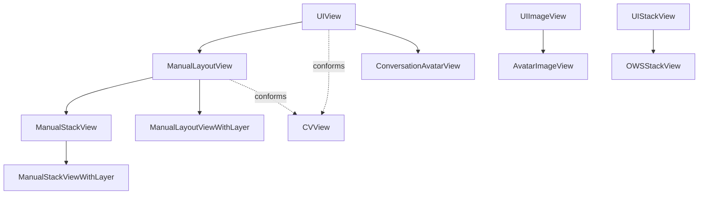

# Reusable Views

Source: `SignalUI/Views/`. A large collection of reusable `UIView` subclasses.
This doc covers the representative building blocks; it is not exhaustive.

> Confidence: **[High]** read in full; **[Medium]** signature/partial; **[Low]**
> inferred. Citations are `File.swift:line`. An uncited claim is a defect.

## Manual layout: `ManualLayoutView` / `ManualStackView`

The conversation view and other performance-sensitive surfaces avoid Auto Layout
in favor of a lightweight manual-layout system.

**[High]** `ManualLayoutView` is an `open class` subclass of `UIView` that also
conforms to `CVView` (`SignalUI/Views/ManualLayoutView.swift:23`; `CVView` is the
conversation-view marker protocol defined at `SignalUI/ConversationView/CVUtils.swift:38`).
Layout is driven by closures: it defines `typealias LayoutBlock = (UIView) -> Void`
(`SignalUI/Views/ManualLayoutView.swift:25`) and `addLayoutBlock(_:)`
(`SignalUI/Views/ManualLayoutView.swift:208`), which run on `layoutSubviews` to
position children by frame rather than by constraints. `ManualLayoutViewWithLayer`
is a variant whose `layerClass` renders (the base uses a non-rendering
`CATransformLayer`) (`SignalUI/Views/ManualLayoutView.swift:15`).

**[High]** `ManualStackView` extends `ManualLayoutView` to arrange children along
an axis (`SignalUI/Views/ManualStackView.swift:24`). It precomputes a
`ManualStackMeasurement` (`measurement` property,
`SignalUI/Views/ManualStackView.swift:30`) and applies an `OWSStackView.Config`
(`axis`/`alignment`/`spacing`) via `apply(config:)`
(`SignalUI/Views/ManualStackView.swift:40-49`). The file comment explains why the
`WithLayer` variant exists: a plain `CATransformLayer` does not render
`backgroundColor`/border/shadow, so views needing those must use
`ManualStackViewWithLayer` (`SignalUI/Views/ManualStackView.swift:9-19`).

**[High]** `OWSStackView` is a conventional (Auto Layout) `UIStackView` subclass
for non-performance-critical cases (`SignalUI/Views/OWSStackView.swift:8`), with
its own `Config`/`LayoutBlock` support (`SignalUI/Views/OWSStackView.swift:50`).

## Avatars

**[High]** `ConversationAvatarView` is the primary avatar view
(`SignalUI/Views/ConversationAvatarView.swift:42`), conforming to `UIView`,
`CVView`, and `PrimaryImageView`. It is the largest view in the directory (~44 KB)
and renders contact/group avatars with configuration-driven sizing. A SwiftUI
bridge exists in `SignalUI/Views/ConversationAvatarView+SwiftUI.swift`. **[Medium]**
`AvatarImageView` (`SignalUI/Views/AvatarImageView.swift:8`) and `CircleView`
(`SignalUI/Views/CircleView.swift:8`) are the simpler circular-image/clipping
primitives beneath it.

## Toasts

**[High]** `ToastController` presents transient toast messages
(`SignalUI/Views/Toast.swift:9`). `presentToastView(from:of:inset:dismissAfter:)`
auto-dismisses after a configurable delay (default `.seconds(4)`)
(`SignalUI/Views/Toast.swift:31-40`), and it observes keyboard show/hide
notifications to reposition (`SignalUI/Views/Toast.swift:24-25`). The actual
rendered view is the private `ToastView` (`SignalUI/Views/Toast.swift:183`).

## Message-bubble & conversation-support views

- **[High]** `OWSBubbleShapeView` draws the message-bubble shape/clip and
  conforms to `OWSBubbleViewPartner` (`SignalUI/Views/OWSBubbleShapeView.swift:37`).
- **[Medium]** Other conversation-support views in this directory include
  `MediaMessageView`, `MediaTextView`, `TextAttachmentView`,
  `DisappearingMessagesChatIndicatorView`, and `GalleryRailView` (read by role/size
  only).

## Text & input views

**[Medium]** `TextViewWithPlaceholder`, `OWSTextView`, `OWSTextField`,
`MediaTextView`, `LinkingTextView`, `TextFieldFormatting`, and `CustomKeyboard`
provide Signal's themed text-entry and custom-keyboard primitives
(`SignalUI/Views/`). `BodyRanges/` (a subdirectory) holds the mention/formatting
("body ranges") editing support.

## Misc utility views

**[Medium]** `CircularProgressView`, `GradientView`, `SelectionIndicatorView`,
`ReminderView`, `ColorPickerBar`, `CaptchaView`, `VideoPlayerView`,
`LoopingVideoView`, `ProfileDetailLabel`, `ApprovalFooterView`, `OWSNavigationBar`,
`OWSLayerView`, `BezierPathView`, `DirectionalPanGestureRecognizer`,
`LineWrappingStackView`, `RTLEnabledCollectionViewFlowLayout`, and the `Tooltips/`
subdirectory are additional reusable views in this directory (enumerated from the
tree; read by name/role only).

