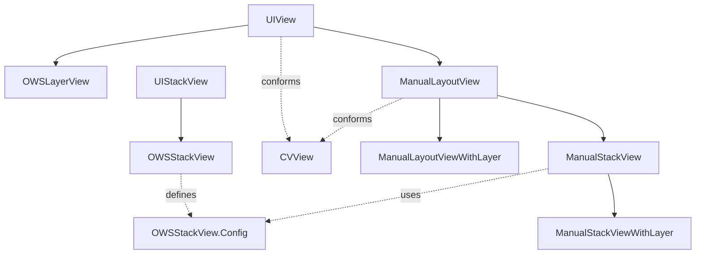

# SignalUI/Views — Reusable View Subsystem

Source: `SignalUI/Views/` (plus the subdirectories `BodyRanges/`,
`BodyRanges/SpoilerRendering/`, and `Tooltips/`). This is SignalUI's library of
reusable `UIView` subclasses, view protocols, and view-adjacent rendering
infrastructure. Screens (the view controllers documented in
[../ViewControllers.md](../ViewControllers.md)) and the conversation view
(documented in [../ConversationView.md](../ConversationView.md)) are assembled
from these building blocks.

This README goes deeper on the mechanics than the overview in
[../Views.md](../Views.md); where the two overlap, this document is the detailed
companion and does not replace it.

> Confidence labels: **[High]** read in full; **[Medium]** signature/partial read
> or depends on code outside this directory; **[Low]** inferred. Citations are
> `File.swift:line`. An uncited claim is a defect.

## Responsibility

The directory provides the shared visual primitives used across the main app and
the share extension:

- A **manual (frame-based) layout system** that the conversation view and other
  performance-sensitive surfaces use instead of Auto Layout.
- **Avatars, bubbles, and conversation-support views** that render chat content.
- **Themed text entry / rich-text editing** (mentions, formatting, spoilers) via
  the `BodyRanges/` subtree.
- **Transient and overlay UI** — toasts and tooltips.
- A grab-bag of **misc utility views** (progress spinners, gradients, color
  pickers, captcha, video players, galleries, etc.).

## Manual layout system

The central abstraction. Rather than paying Auto Layout's cost per cell, these
views position children by frame via stored closures.

**[High]** `ManualLayoutView` is an `open class` subclass of `UIView` that also
conforms to `CVView` (`SignalUI/Views/ManualLayoutView.swift:23`). Its core
mechanic:

- `typealias LayoutBlock = (UIView) -> Void` and `addLayoutBlock(_:)` register
  layout closures (`SignalUI/Views/ManualLayoutView.swift:25`,
  `SignalUI/Views/ManualLayoutView.swift:208`). They run during
  `applyLayoutBlocks()` (`SignalUI/Views/ManualLayoutView.swift:136`), which
  is invoked from `layoutSubviews()`
  (`SignalUI/Views/ManualLayoutView.swift:126`).
- Size changes to `bounds`/`frame` trigger a re-layout via `viewSizeDidChange()`
  (`SignalUI/Views/ManualLayoutView.swift:116`).
- `reset()` clears subviews, layout/transform blocks, the tap handler, and
  gesture recognizers so an instance can be recycled
  (`SignalUI/Views/ManualLayoutView.swift:169`) — important for the
  conversation view's cell reuse.
- Convenience helpers build common arrangements as layout blocks:
  `centerSubviewOnSuperview(_:size:)`
  (`SignalUI/Views/ManualLayoutView.swift:255`),
  `layoutSubviewToFillSuperview(_:honorLayoutsMargins:)`
  (`SignalUI/Views/ManualLayoutView.swift:324`), and the circle/pill factories
  (`SignalUI/Views/ManualLayoutView.swift:71`,
  `SignalUI/Views/ManualLayoutView.swift:77`;
  `addPillBlock()` `SignalUI/Views/ManualLayoutView.swift:189`).
- `addTransformBlock(_:)` / `applyTransformBlocks()` apply post-layout transforms
  recursively down the `ManualLayoutView` subtree, then clear themselves
  (`SignalUI/Views/ManualLayoutView.swift:144-157`).

**[High]** The base `layerClass` is `CATransformLayer`
(`SignalUI/Views/ManualLayoutView.swift:33`), which does **not** render. The file
comment is explicit: to use `backgroundColor`/border/`masksToBounds`/shadow you
must use `ManualLayoutViewWithLayer`, whose `layerClass` is a plain `CALayer`
(`SignalUI/Views/ManualLayoutView.swift:7-18`). This split is the subtle gotcha
of the whole system.

**[High]** `ManualStackView` extends `ManualLayoutView` to arrange children along
an axis (`SignalUI/Views/ManualStackView.swift:24`). It precomputes a
`ManualStackMeasurement` (`measurement` property,
`SignalUI/Views/ManualStackView.swift:30`) and applies an `OWSStackView.Config`
(`axis`/`alignment`/`spacing`/`layoutMargins`) via `apply(config:)`
(`SignalUI/Views/ManualStackView.swift:45-62`). The same rendering caveat applies,
so `ManualStackViewWithLayer` exists for backgrounds/borders/shadows
(`SignalUI/Views/ManualStackView.swift:16`, comment at
`SignalUI/Views/ManualStackView.swift:8-14`).

**[High]** `OWSStackView` is the conventional (Auto Layout) `UIStackView` subclass
for non-performance-critical cases (`SignalUI/Views/OWSStackView.swift:8`). Its
nested `Config` struct (`SignalUI/Views/OWSStackView.swift:10`) is the shared
value type that `ManualStackView` reuses via
`typealias Config = OWSStackView.Config` (`SignalUI/Views/ManualStackView.swift:44`).
`apply(config:)` only writes properties that actually changed
(`SignalUI/Views/OWSStackView.swift:99-116`), and the file retroactively adds
`CustomStringConvertible` to `NSLayoutConstraint.Axis` and
`UIStackView.Alignment` for debugging (`SignalUI/Views/OWSStackView.swift:155`,
`SignalUI/Views/OWSStackView.swift:179`).

**[High]** `OWSLayerView` is a simpler `UIView` with a single `layoutCallback`
closure invoked on bounds changes, plus `circleView()`/`pillView()` factories
(`SignalUI/Views/OWSLayerView.swift:8`, `:30-57`). It is the lightweight
alternative when a single layout closure (not the full block system) is enough.

## Avatars

**[High]** `ConversationAvatarView` is the primary avatar view and the largest
file in the directory (~44 KB) (`SignalUI/Views/ConversationAvatarView.swift:42`).
It conforms to `UIView`, `CVView`, and `PrimaryImageView`, and is driven by a
`Configuration` value (size class, data source, local-user display mode, badge,
shape) passed at init (`SignalUI/Views/ConversationAvatarView.swift:44-67`). It
composes three stacked subviews — `storyStateView`, `avatarView`, `badgeView`
(`SignalUI/Views/ConversationAvatarView.swift:62-64`) — so a single view can show
avatar + badge + story ring.

**[High]** The `ConversationAvatarViewDelegate` protocol (constrained to
`UIViewController`) handles taps, and its default `didTapAvatar(_:)` presents an
`ActionSheetController` offering "View Photo" / "View Story" when stories exist
(`SignalUI/Views/ConversationAvatarView.swift:9-39`) — a direct dependency on the
action-sheet types documented in [../ViewControllers.md](../ViewControllers.md).

**[Medium]** A SwiftUI bridge lives in
`SignalUI/Views/ConversationAvatarView+SwiftUI.swift`. The simpler primitives
beneath it are `AvatarImageView` (`SignalUI/Views/AvatarImageView.swift:8`) and
`CircleView` (`SignalUI/Views/CircleView.swift`) (read by role/size only).

**[High]** `PrimaryImageView` is the protocol tying this together: any view that
exposes a read-only `primaryImage` for transitions
(`SignalUI/Views/PrimaryImageView.swift:9`). `UIImageView` is extended to conform
(`SignalUI/Views/PrimaryImageView.swift:14`), so image views can participate in
Signal's media transition animations uniformly.

## Message-bubble & conversation-support views

**[High]** `OWSBubbleShapeView` draws into a subregion of a message bubble shape
and conforms to `OWSBubbleViewPartner` (`SignalUI/Views/OWSBubbleShapeView.swift:37`).
Its `Mode` enum supports stroke/fill/`strokeAndFill`/shadow/clip/`innerShadow`
rendering (`SignalUI/Views/OWSBubbleShapeView.swift:40-50`), and it collaborates
with an `OWSBubbleViewHost` that supplies the bubble `maskPath`/reference view
(`SignalUI/Views/OWSBubbleShapeView.swift:23-26`). The partner/host protocol pair
(`SignalUI/Views/OWSBubbleShapeView.swift:23-31`) lets a media subview clip itself
to the rounded bubble it sits inside.

**[Medium]** Other conversation-support views in this directory, read by
role/size only: `MediaMessageView` (`SignalUI/Views/MediaMessageView.swift`),
`MediaTextView` (`SignalUI/Views/MediaTextView.swift`), `TextAttachmentView`
(the largest text view, ~33 KB, `SignalUI/Views/TextAttachmentView.swift`),
`DisappearingMessagesChatIndicatorView`
(`SignalUI/Views/DisappearingMessagesChatIndicatorView.swift`), and
`GalleryRailView` (`SignalUI/Views/GalleryRailView.swift:173`, with its
`GalleryRailItemProvider`/`GalleryRailItem` protocols at
`SignalUI/Views/GalleryRailView.swift:7-14`).

## Rich text: `BodyRanges/`

This subtree implements Signal's "body ranges" — the mention + text-styling model
layered on top of plain message text.

**[High]** `BodyRangesTextView` is an `open class` subclass of `OWSTextView` that
conforms to `EditableMessageBodyDelegate`, `UITextViewDelegate`, and
`UIEditMenuInteractionDelegate` (`SignalUI/Views/BodyRanges/BodyRangesTextView.swift:33`).
It owns an `EditableMessageBodyTextStorage` built on
`DependenciesBridge.shared.db` and a custom `NSLayoutManager`
(`SignalUI/Views/BodyRanges/BodyRangesTextView.swift:49-62`), overriding
`layoutManager` to return it (`SignalUI/Views/BodyRanges/BodyRangesTextView.swift:77`).
Its `BodyRangesTextViewDelegate` protocol (`SignalUI/Views/BodyRanges/BodyRangesTextView.swift:10-24`)
is how a host screen supplies mention candidates
(`textViewMentionPickerPossibleAcis`), display configuration, picker style, and
mention-begin/end callbacks. It also carries an explicit pre-iOS-16 edit-menu
fallback (`BodyRangesTextViewIOS15EditMenu`,
`SignalUI/Views/BodyRanges/BodyRangesTextView.swift:65-73`). This is the richest
single view in the directory and depends on `LibSignalClient`/`SignalServiceKit`.

**[High]** `MentionPicker` is the dropdown of mentionable users
(`SignalUI/Views/BodyRanges/MentionPicker.swift:16`). It reads the DB on init to
sort mentionable addresses and resolve display names via
`SSKEnvironment.shared.contactManager*`
(`SignalUI/Views/BodyRanges/MentionPicker.swift:25-45`), excluding the local user.
Its `MentionPickerStyle` enum (`default`/`composingAttachment`/`groupReply`)
drives background styling (`SignalUI/Views/BodyRanges/MentionPicker.swift:9-13`,
`:52-57`).

**[High]** `MessageBodyDisplayConfigurations.swift` and
`SearchDisplayConfigurations.swift` extend
`HydratedMessageBody.DisplayConfiguration` (an SSK type) with SignalUI-specific
factories — e.g. `forMeasurement(font:)`, `forUnstyledText(font:textColor:)`,
`messageBubble(isIncoming:...)`
(`SignalUI/Views/BodyRanges/MessageBodyDisplayConfigurations.swift:9-30`). These
are the bridge from the SSK message-body model to the rendering done here.

### Spoiler rendering: `BodyRanges/SpoilerRendering/`

**[High]** A Metal-backed particle animation that obscures spoiler text ranges.
`SpoilerableViewAnimator` is the key protocol: a (possibly separate) object that
reports the `spoilerableView`, a cheap `spoilerFramesCacheKey`, and the expensive
`spoilerFrames()` (`SignalUI/Views/BodyRanges/SpoilerRendering/SpoilerAnimationManager.swift:39-50`).
Decoupling the animator from the view (per the doc comment,
`SignalUI/Views/BodyRanges/SpoilerRendering/SpoilerAnimationManager.swift:33-37`)
avoids forcing every spoilerable view into a common subclass.

- `SpoilerAnimationManager` orchestrates the animators
  (`SignalUI/Views/BodyRanges/SpoilerRendering/SpoilerAnimationManager.swift:71`).
- `SpoilerRenderer` produces the actual tiled particle effects with
  `standard`/`highlight` configs scaled by display scale
  (`SignalUI/Views/BodyRanges/SpoilerRendering/SpoilerRenderer.swift:11`, `:22-37`).
- `SpoilerFrame` carries each region's `frame`, `ThemedColor`, and `Style`
  (`SignalUI/Views/BodyRanges/SpoilerRendering/SpoilerAnimationManager.swift:11-23`).
- Supporting files: `SpoilerableTextViewAnimator.swift`,
  `SpoilerableLabelAnimator.swift`, `SpoilerParticleView.swift`,
  `SpoilerRenderState.swift`, and the Metal shader
  `SpoilerParticleShader.metal` (read by role only, **[Medium]**).

The `ThemedColor` usage ties this directly to the theming model in
[../Appearance.md](../Appearance.md).

## Overlays: toasts & tooltips

**[High]** `ToastController` presents transient toast messages
(`SignalUI/Views/Toast.swift:9`). `presentToastView(from:of:inset:dismissAfter:)`
auto-dismisses after a configurable delay (default `.seconds(4)`)
(`SignalUI/Views/Toast.swift:33-40`), observes keyboard show/hide notifications to
reposition (`SignalUI/Views/Toast.swift:26-27`), and walks up out of any enclosing
`UIScrollView` so the toast isn't scrolled away
(`SignalUI/Views/Toast.swift:47-51`). The rendered view is the private `ToastView`
(`SignalUI/Views/Toast.swift:183`).

**[High]** The `Tooltips/` subdirectory implements anchored tooltips. `Tooltip` is
a value type describing title/message/icon/close-button plus `passthroughViews`
and a `TapAction` (`.dismiss` or `.custom`)
(`SignalUI/Views/Tooltips/Tooltip.swift:9-29`); `TooltipViewController` presents it
(an `OWSViewController` subclass, `SignalUI/Views/Tooltips/Tooltip.swift:98`).
`TooltipView` is the drawn bubble (`SignalUI/Views/Tooltips/TooltipView.swift:8`),
and `ViewOnceTooltip` is a concrete specialization
(`SignalUI/Views/Tooltips/ViewOnceTooltip.swift`).

## Text & input primitives

**[Medium]** `OWSTextView` (`SignalUI/Views/OWSTextView.swift`), `OWSTextField`
(`SignalUI/Views/OWSTextField.swift`), `TextViewWithPlaceholder`
(`SignalUI/Views/TextViewWithPlaceholder.swift`), `LinkingTextView`
(`SignalUI/Views/LinkingTextView.swift`), and `TextFieldFormatting`
(`SignalUI/Views/TextFieldFormatting.swift`) provide Signal's themed text-entry
primitives. `BodyRangesTextView` (above) subclasses `OWSTextView`.

**[High]** `CustomKeyboard` is an `open class` subclass of `UIInputView` providing
`willPresent`/`wasPresented`/`willDismiss`/`wasDismissed` lifecycle hooks
(`SignalUI/Views/CustomKeyboard.swift:8`, `:25-28`). It wires those hooks to
`willMove(toSuperview:)`/`didMoveToSuperview()`, deferring the "was" callbacks to
the next run loop (`SignalUI/Views/CustomKeyboard.swift:31-49`) — the base for
Signal's in-app custom keyboards (e.g. sticker/emoji pickers).

## Misc utility views

- **[High]** `CircularProgressView` — determinate + multi-phase indeterminate
  spinner with an explicit animation state machine
  (`SignalUI/Views/CircularProgressView.swift:9`, state enum at `:15-26`).
- **[High]** `RTLEnabledCollectionViewFlowLayout` — a one-line flow layout that
  flips horizontally in RTL by overriding
  `flipsHorizontallyInOppositeLayoutDirection`
  (`SignalUI/Views/RTLEnabledCollectionViewFlowLayout.swift:7-10`); a concrete
  localization/accessibility consideration.
- **[Medium]** `GradientView` (`SignalUI/Views/GradientView.swift`),
  `SelectionIndicatorView` (`SignalUI/Views/SelectionIndicatorView.swift`),
  `ReminderView` (`SignalUI/Views/ReminderView.swift`), `ColorPickerBar`
  (`SignalUI/Views/ColorPickerBar.swift`), `CaptchaView`
  (`SignalUI/Views/CaptchaView.swift`), `VideoPlayerView`
  (`SignalUI/Views/VideoPlayerView.swift`), `LoopingVideoView`
  (`SignalUI/Views/LoopingVideoView.swift`), `ProfileDetailLabel`
  (`SignalUI/Views/ProfileDetailLabel.swift`), `ApprovalFooterView`
  (`SignalUI/Views/ApprovalFooterView.swift`), `OWSNavigationBar`
  (`SignalUI/Views/OWSNavigationBar.swift`), `BezierPathView`
  (`SignalUI/Views/BezierPathView.swift`), `DirectionalPanGestureRecognizer`
  (`SignalUI/Views/DirectionalPanGestureRecognizer.swift`),
  `LineWrappingStackView` (`SignalUI/Views/LineWrappingStackView.swift`),
  `PrimaryImageView` (`SignalUI/Views/PrimaryImageView.swift`), and the payments
  helpers `PaymentOnboarding`/`PaymentActionSheets`
  (`SignalUI/Views/PaymentOnboarding.swift`,
  `SignalUI/Views/PaymentActionSheets.swift`) round out the directory (enumerated
  from the tree; read by name/role or signature only).

## Interactions with the rest of SignalUI and the app

- **Conversation view.** `ManualLayoutView`/`ManualStackView` conform to `CVView`
  (`SignalUI/Views/ManualLayoutView.swift:23`,
  `SignalUI/Views/ManualStackView.swift:24`) and are the frame-based primitives the
  conversation renderer uses (see [../ConversationView.md](../ConversationView.md)).
  `OWSBubbleShapeView` renders bubble geometry for message cells.
- **View controllers / action sheets.** `ConversationAvatarView`'s delegate
  builds an `ActionSheetController` (`SignalUI/Views/ConversationAvatarView.swift:21`)
  and `TooltipViewController` subclasses `OWSViewController`
  (`SignalUI/Views/Tooltips/Tooltip.swift:98`), tying this directory to
  [../ViewControllers.md](../ViewControllers.md).
- **Theming.** Spoiler colors and many views use `ThemedColor`/`Theme`
  (`SignalUI/Views/BodyRanges/SpoilerRendering/SpoilerAnimationManager.swift:22`),
  the receiving end of the propagation described in
  [../Appearance.md](../Appearance.md).
- **SignalServiceKit.** Nearly every file imports `SignalServiceKit`; the body
  ranges / mention code additionally depends on `LibSignalClient` and reads the
  database directly (`SignalUI/Views/BodyRanges/MentionPicker.swift:25`), so these
  views are **[Medium]** confidence where behavior crosses the SSK boundary.

## Notable UI considerations

- **Render vs. non-render layers.** The `CATransformLayer` default on
  `ManualLayoutView`/`ManualStackView` silently drops backgrounds/borders/shadows;
  the `WithLayer` variants exist specifically to fix this
  (`SignalUI/Views/ManualLayoutView.swift:7-18`,
  `SignalUI/Views/ManualStackView.swift:8-14`).
- **Reuse safety.** `reset()` fully tears down blocks, gestures, and subviews so
  recycled cells don't leak stale layout
  (`SignalUI/Views/ManualLayoutView.swift:169`).
- **RTL / localization.** `RTLEnabledCollectionViewFlowLayout` flips horizontal
  layout for right-to-left languages
  (`SignalUI/Views/RTLEnabledCollectionViewFlowLayout.swift:7-10`).
- **Keyboard awareness.** Toasts reposition on keyboard notifications
  (`SignalUI/Views/Toast.swift:26-27`) and escape enclosing scroll views
  (`SignalUI/Views/Toast.swift:47-51`).
- **Accessibility/debug.** Manual layout and stack views set an
  `accessibilityLabel` from their `name` under `TESTABLE_BUILD`
  (`SignalUI/Views/ManualLayoutView.swift:46`,
  `SignalUI/Views/OWSStackView.swift:62`).
- **OS-version fallbacks.** `BodyRangesTextView` carries an explicit pre-iOS-16
  edit-menu path (`SignalUI/Views/BodyRanges/BodyRangesTextView.swift:65-73`), and
  `MentionPickerStyle.composingAttachment` is marked deprecated for iOS 26
  (`SignalUI/Views/BodyRanges/MentionPicker.swift:11`).
